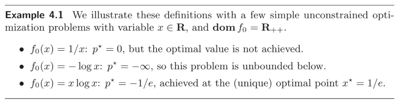
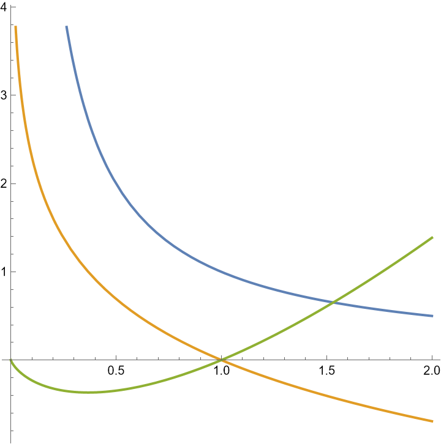
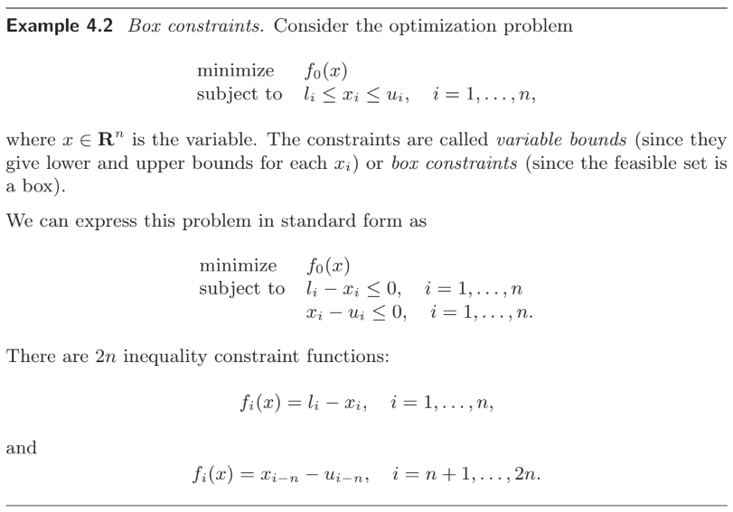
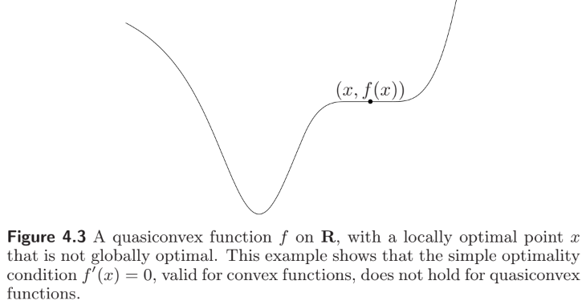
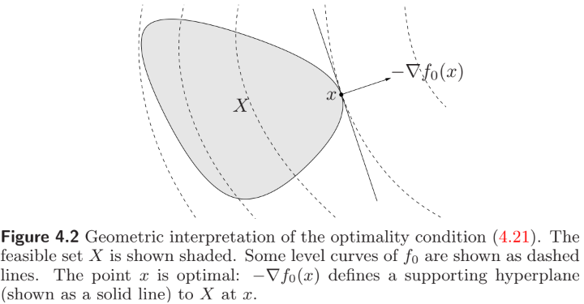
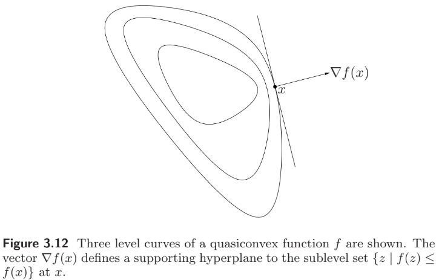

# Convex Optimization

**Stephen Boyd** (https://en.wikipedia.org/wiki/Stephen_P._Boyd)

- Samsung Professor of Engineering, Professor in Electrical Engineering, and professor by courtesy in Computer Science and Management Science & Engineering at Stanford University

**Lieven Vandenberghe**

- Professor of Electrical and Computer Engineering Department and Department of Mathematics at University of California, Los Angeles

**References**

- **Convex Optimization** (2004)
  - Cambridge University Press, https://web.stanford.edu/~boyd/cvxbook/
- **strutive07 블로그** (2020)
  - https://strutive07.github.io/archive.html?tag=Convex_Optimization

## Chapter 4. Convex optimization problems

##### Notation

- $\mathbf{R}=\mathbb{R}$, the set of real numbers
- $\mathbf{R}_+=\mathbb{R}_{\geq 0}$, the set of nonnegative real numbers
- $\mathbf{R}_{++}=\mathbb{R}_{>0}$​, , the set of positive real numbers
- $\mathbf{R}^{m\times n}=\mathbb{R}^{m\times n}$, the set of $m\times n$​ real matrices
- $\mathbf{S}^n=\mathbb{R}^{n\times n}_\text{sym}$, the set of symmetric $n\times n$ real matrices
- $\mathbf{S}^n_+=\mathbb{R}^{n\times n}_{\succeq 0}$, the set of (symmetric) positive semidefinite $n\times n$ real matrices
- $\mathbf{S}^n_{++}=\mathbb{R}^{n\times n}_{\succ 0}$, the set of (symmetric) positive definite $n\times n$ real matrices

### 4.1 Optimization problems

#### 4.1.1 Basic terminology

An **optimization problem** in **standard form** is one of the form
$$
\begin{align*}
\text{minimize}  &\qquad f_0(x) \\
\text{subject to} &\qquad f_i(x)\leq 0, \quad 1\leq i\leq m \\
&\qquad h_j(x)=0, \quad 1\leq j\leq p.
\end{align*} \tag{4.1}
$$
The set of points for which the objective and all constraint functions are defined is called the **domain** $\mathcal{D}$ of (4.1).

A point $x\in\mathcal{D}$ is called **feasible** if $f_i(x)\leq 0$ and $h_j(x)=0$ for all $i,j$. The set of all feasible points is the **feasible set**.

The **optimal value** of (4.1) is defined as
$$
p^*=\inf\{f_0(x)\mid \text{$x$ is feasible}\}\in\mathbb{R}\cup\{\pm\infty\}
$$
(following $\inf\varnothing=\infty$). If there are feasible solutions $x_k$ with $f_0(x_k)\to-\infty$ as $k\to\infty$, then $p^*=-\infty$ and we say (4.1) is **unbounded below**.

A <u>feasible point</u> $x^*$ is called **optimal** if $f_0(x^*)=p^*$. The set of all optimal points is the **optimal set**. If there exists an optimal point for (4.1)​, we say the optimal value is **achieved**, and the problem is **solvable**.

A <u>feasible point</u> $x$ is called $\epsilon$-**suboptimal** if $f_0(x)\leq p^*+\epsilon$ for $\epsilon>0$. The set of all $\epsilon$-suboptimal points is the $\epsilon$-**suboptimal set**.

A <u>feasible point</u> $x$ is called **locally optimal** if there is an $R>0$ such that
$$
f_0(x) = \inf\{f_0(z)\mid\text{$z$ is feasible, $\|z-x\|_2\leq R$}\}.
$$

<figure style="text-align: left; padding-top: .5em; padding-bottom: .5em;">
  
</figure>

If $f_0(x)\equiv 0$, the optimal value is either 0 (if the feasible set is nonempty) or $\infty$ (if the feasible set is empty). We call this the **feasibility problem**
$$
\begin{align*}
\text{find}  &\qquad x \\
\text{subject to} &\qquad f_i(x)\leq 0, \quad 1\leq i\leq m \\
&\qquad h_j(x)=0, \quad 1\leq j\leq p.
\end{align*}
$$

#### 4.1.2 Expressing problems in standard form

<figure style="text-align: left; padding-top: .5em; padding-bottom: .5em;">
  
</figure>
We can solve the **maximization problem**
$$
\begin{align*}
\text{maximize}  &\qquad f_0(x) \\
\text{subject to} &\qquad f_i(x)\leq 0, \quad 1\leq i\leq m \\
&\qquad h_j(x)=0, \quad 1\leq j\leq p
\end{align*} \tag{4.2}
$$
by minimizing $-f_0(x)$​ subject to the constraints. The **optimal value** of (4.2) is defined as
$$
p^* = \sup\{f_0(x)\mid\text{$x$ is feasible}\}\in\mathbb{R}\cup\{\pm\infty\}
$$
and a <u>feasible point</u> $x$ is $\epsilon$-**suboptimal** if $f_0(x)\geq p^*-\epsilon$ for $\epsilon>0$.

#### 4.1.3 Equivalent problems

##### Change of variables

Suppose $\phi\colon\mathbb{R}^n\to\mathbb{R}^n$ is <u>one-to-one</u>, with image covering $\mathcal{D}$. Then the problem
$$
\begin{align*}
\text{minimize}  &\qquad \tilde f_0(z)\equiv f_0(\phi(z)) \\
\text{subject to} &\qquad \tilde f_i(z)\equiv f_i(\phi(z))\leq 0, \quad 1\leq i\leq m \\
&\qquad \tilde h_j(z)\equiv h_j(\phi(z))=0, \quad 1\leq j\leq p
\end{align*} \tag{4.4}
$$
and (4.1) are <u>equivalent</u>: If $x$ solves (4.1) then $z=\phi^{-1}(x)$ solves (4.4); if $z$ solves (4.4) then $x=\phi(z)$​ solves (4.1).

##### Transformation of objective and constraint functions

Suppose $\psi_0\colon\mathbb{R}\to\mathbb{R}$ is <u>monotone increasing</u> on the image of $f_0$, and $\psi_i\colon\mathbb{R}\to\mathbb{R}$ satisfy $\psi_i(u)\leq 0 \Leftrightarrow u\leq 0$ and $\xi_j\colon\mathbb{R}\to\mathbb{R}$ satisfy $\xi_j(u)=0 \Leftrightarrow u=0$. Then the problem
$$
\begin{align*}
\text{minimize}  &\qquad \tilde f_0(x)\equiv \psi_0(f_0(x)) \\
\text{subject to} &\qquad \tilde f_i(x)\equiv \psi_i(f_i(x))\leq 0, \quad 1\leq i\leq m \\
&\qquad \tilde h_j(x)\equiv \xi_j(h_j(x))=0, \quad 1\leq j\leq p
\end{align*}
$$
and (4.1) are <u>equivalent</u>: The feasible sets are identical, and the optimal points are identical.

<figure style="text-align: left; padding-top: .5em; padding-bottom: .5em;">
  
</figure>

##### Slack variables

Notice that $f_i(x)\leq 0$ <u>if and only if</u> there is an $s_i\geq 0$ such that $f_i(x)+s_i=0$. The new variable $s_i$ is called the **slack variable** associated with $f_i(x)\leq 0$. Then the problem
$$
\begin{align*}
\text{minimize}  &\qquad f_0(x) \\
\text{subject to} &\qquad s_i\geq 0, \quad 1\leq i\leq m \\
&\qquad f_i(x)+s_i= 0, \quad 1\leq i\leq m \\
&\qquad h_j(x)=0, \quad 1\leq j\leq p
\end{align*} \tag{4.7}
$$
is <u>equivalent</u> to (4.1).

##### Eliminating equality constraints

If we can <u>explicitly parametrize</u> all solutions of $h_j(x)=0$ using some parameter $z\in\mathbb{R}^k$​, then we can eliminate $h_j(x)=0$ from the problem, as follows.

Suppose $\phi\colon\mathbb{R}^k\to\mathbb{R}^n$ is such that $x\in\mathbb{R}^n$ satisfies $h_j(x)=0$ for all $1\leq j\leq p$ <u>if and only if</u> there is some $z\in\mathbb{R}^k$ with $x=\phi(z)$. Then the problem
$$
\begin{align*}
\text{minimize}  &\qquad f_0(\phi(z)) \\
\text{subject to} &\qquad f_i(\phi(z))\leq 0, \quad 1\leq i\leq m
\end{align*}
$$
is <u>equivalent</u> to (4.1).

##### Eliminating linear equality constraints

The process of eliminating variables can be described more explicitly <u>when the equality constraints are all linear</u>, i.e., $Ax=b$ for some $A\in\mathbb{R}^{p\times n}$.

Assume that the original problem (4.1) is feasible, and let $x_0\in\mathbb{R}^n$ such that $Ax_0=b$.

Let $F\in\mathbb{R}^{n\times k}$ be a matrix of which the columns are a basis of the null space $\mathcal{N}(A)$. Then the general solution of $Ax=b$ is given by $Fz+x_0$ for $z\in\mathbb{R}^k$. Note that $x\in\mathcal{N}(A)$, i.e., $Ax=0$ <u>if and only if</u> there is some $z\in\mathbb{R}^k$ with $Fz=x$. Then the problem
$$
\begin{align*}
\text{minimize}  &\qquad f_0(Fz+x_0) \\
\text{subject to} &\qquad f_i(Fz+x_0)\leq 0, \quad 1\leq i\leq m
\end{align*}
$$
is <u>equivalent</u> to (4.1).

##### Introducing equality constraints

Consider the problem
$$
\begin{align*}
\text{minimize}  &\qquad f_0(A_0x+b_0) \\
\text{subject to} &\qquad f_i(A_ix+b_i)\leq 0, \quad 1\leq i\leq m \\
&\qquad h_j(x)=0, \quad 1\leq j\leq p
\end{align*}
$$
where $A_i\in\mathbb{R}^{k_i\times n}$ and $f_i\colon\mathbb{R}^{k_i}\to\mathbb{R}$. In this problem the objective and inequality constraints are given as compositions of $f_i$ with <u>affine transformations</u> $A_ix+b_i$. 

We introduce new variables $y_i\in\mathbb{R}^{k_i}$, as well as new equality constraints $y_i=A_ix+b_i$ for $0\leq i\leq m$, and form the <u>equivalent</u> problem
$$
\begin{align*}
\text{minimize}  &\qquad f_0(y_0) \\
\text{subject to} &\qquad f_i(y_i)\leq 0, \quad 1\leq i\leq m \\
&\qquad y_i=A_ix+b_i, \quad 0\leq i\leq m \\
&\qquad h_j(x)=0, \quad 1\leq j\leq p.
\end{align*}
$$
This problem has $\sum_{i=0}^m k_i$ new variables and $\sum_{i=0}^m k_i$ new equality constraints. However, the objective ($y_0$) and inequality constraints ($y_1,\dotsc,y_m$) are <u>independent</u>, i.e., involve different optimization variables.

##### Optimizing over some variables

Suppose $x\in\mathbb{R}^n$ is partitioned as $x=(x_1,x_2)$ with $x_i\in\mathbb{R}^{n_i}$ and $n_1+n_2=n$. Consider the problem
$$
\begin{align*}
\text{minimize}  &\qquad f_0(x_1,x_2) \\
\text{subject to} &\qquad f_i(x_1)\leq 0, \quad 1\leq i\leq m_1 \\
&\qquad \tilde f_i(x_2)\leq 0, \quad 1\leq i\leq m_2.
\end{align*} \tag{4.9}
$$
Define $\tilde f_0(x_1)=\inf\{f_0(x_1,z)\mid\tilde f_i(z)\leq 0\text{ for $1\leq i\leq m_2$}\}$. The problem (4.9) is then <u>equivalent</u> to
$$
\begin{align*}
\text{minimize}  &\qquad \tilde f_0(x_1) \\
\text{subject to} &\qquad f_i(x_1)\leq 0, \quad 1\leq i\leq m_1.
\end{align*} \tag{4.10}
$$

<figure style="text-align: left; padding-top: .5em; padding-bottom: .5em;">
  
</figure>
##### Epigraph problem form

The epigraph form of (4.1) is the problem
$$
\begin{align*}
\text{minimize}  &\qquad t \\
\text{subject to} &\qquad f_0(x)-t\leq 0 \\
&\qquad f_i(x)\leq 0, \quad 1\leq i\leq m \\
&\qquad h_j(x)=0, \quad 1\leq j\leq p
\end{align*} \tag{4.11}
$$
which is <u>equivalent</u> to (4.1): $(x,t)$ is optimal for (4.11) <u>if and only if</u> $x$ is optimal for (4.1) and $t=f_0(x)$. Note that the objective function of (4.11) is linear.

#### 4.1.4 Parameter and oracle problem descriptions

##### Parameter problem description

The objective and constraint functions have some analytical or closed form, i.e., are given by a formula or expression that involves the variable $x$​ as well as some <u>parameters</u>.

For example, $f_0(x)=\frac{1}{2}x^TPx+q^Tx+r$. Here, $P\in\mathbb{R}^{n\times n}_\text{sym}$, $q\in\mathbb{R}^n$ and $r\in\mathbb{R}$ are problem parameters.

##### Oracle problem description

The objective and constraint functions are described by <u>oracle models</u> (which are also called <u>black box</u> or <u>subroutine models</u>).

In an oracle model, we do not know $f$ explicitly, but can evaluate $f(x)$ (and usually also some derivatives). This is referred to as <u>querying the oracle</u>, and is usually associated with some cost, such as time.

### 4.2 Convex optimization

#### 4.2.1 Convex optimization problems in standard form

A **convex optimization problem** is one of the form
$$
\begin{align*}
\text{minimize}  &\qquad f_0(x) \\
\text{subject to} &\qquad f_i(x)\leq 0, \quad 1\leq i\leq m \\
&\qquad h_j(x)=a_j^Tx-b_j=0, \quad 1\leq j\leq p,
\end{align*} \tag{4.15}
$$
where $f_i$ are <u>convex</u> functions for all $0\leq i\leq m$​, and $h_j$ are <u>affine</u> for all $1\leq j\leq p$.

<u>We may assume without loss of generality that</u> $a_j\neq0$: If $a_j=b_j=0$, the $j$-th equality constraint can be deleted; if $a_j=0$ and $b_j\neq0$, the $j$-th equality constraint is inconsistent and the problem is infeasible.

<u>The feasible set of a convex optimization problem is convex</u>, since it is the intersection of the (convex) domain $\mathcal{D}$ with $m$ (convex) sublevel sets and $p$ hyperplanes. Thus, we minimize a convex objective function over a convex set.

> A function $f\colon\mathbb{R}\to\mathbb{R}$ is called **quasiconvex** if its domain and all its sublevel sets $S_\alpha=\{x\in\operatorname{Dom}f\mid f(x)\leq\alpha\}$ for $\alpha\in\mathbb{R}$​​ are convex.
>
> A function is **quasiconcave** if $-f$ is quasiconvex. A function that is both quasiconvex and quasiconcave is called **quasilinear**.
>
> 

If $f_0$ is <u>quasiconvex</u>, we say (4.15) is a (standard form) **quasiconvex optimization problem**.

<u>The $\epsilon$-suboptimal sets are convex</u> for a convex or quasiconvex optimization problem, since the sublevel sets of a convex or quasiconvex function are convex. In particular, <u>the optimal set is convex</u>.

If the objective is <u>strictly convex</u>, the optimal set contains <u>at most one point</u>.

##### Concave maximization problems

$$
\begin{align*}
\text{maximize}  &\qquad f_0(x) \\
\text{subject to} &\qquad f_i(x)\leq 0, \quad 1\leq i\leq m \\
&\qquad h_j(x)=a_j^Tx-b_j=0, \quad 1\leq j\leq p,
\end{align*} \tag{4.16}
$$

where $f_0$ is <u>concave</u> and $f_i$ are <u>convex</u> for all $1\leq i\leq m$. This problem can be solved by minimizing $-f_0$. In a similar way (4.16) is called **quasiconcave** if $f_0$ is quasiconcave.

#### 4.2.2 Local and global optima

Any <u>locally optimal</u> point is also <u>(globally) optimal</u>.

> _Proof._ Suppose $x$ is <u>locally optimal</u>, i.e., $x$ is feasible and for some $R>0$,
> $$
> f_0(x) = \inf\{f_0(z)\mid\text{$z$ is feasible, $\|z-x\|_2\leq R$}\}. \tag{4.19}
> $$
> Now suppose $x$ is <u>not globally optimal</u>. Then there is a feasible $y$ such that $f_0(y)<f_0(x)$ and $\|y-x\|>R$. Consider the point $z$ given by
> $$
> z = (1-\theta)x + \theta y \quad\text{where }\theta = \frac{R}{2\|y-x\|_2}.
> $$
> Then $z$ is feasible and $\|z-x\|_2=\frac{R}{2}<R$, so $f_0(x)\leq f_0(z)$. However,
> $$
> f_0(z) \leq (1-\theta)f_0(x)+\theta f_0(y) < f_0(x),
> $$
> which contradicts (4.19). Hence, $x$ is globally optimal.

It is <u>not true</u> that locally optimal points of <u>quasiconvex optimization problems</u> are globally optimal.

#### 4.2.3 An optimality criterion for differentiable $f_0$

Suppose $f_0$ is <u>differentiable</u>. Then $x$ is optimal <u>if and only if</u> $x$ is feasible and
$$
\nabla f_0(x)^T(y-x) \geq 0 \quad\text{for all feasible $y$}. \tag{4.21}
$$

> Suppose $f$ is differentiable. Then $f$ is convex <u>if and only if</u> $\operatorname{Dom}f$ is convex and
> $$
> f(y) \geq f(x) + \nabla f(x)^T(y-x) \tag{4.20}
> $$
>  holds for all $x,y\in\operatorname{Dom}f$​ (see $\S$3.1.3).

> _Proof._ ($\Leftarrow$) If $x$ is feasible and satisfies (4.21), then $f_0(y)-f_0(x)=\nabla f_0(x)^T(y-x)\geq 0$ for all feasible $y$. Thus $x$ is optimal.
>
> ($\Rightarrow$) Suppose $x$ is optimal, but (4.21) <u>does not hold</u>, i.e., $\nabla f_0(x)^T(y-x)<0$ for some feasible $y$​. Consider the feasible path $z(t)=ty+(1-t)x$ for $t\in[0,1]$. Then for small $t>0$, we have $f_0(z(t))<f_0(x)$, since
> $$
> \frac{d}{dt}f_0(z(t))\Big|_{t=0} = \nabla f_0(x)^T(y-x) < 0.
> $$

##### Unconstrained problems

For an <u>unconstrained</u> problem, (4.21) reduces to
$$
\nabla f_0(x) = 0 \tag{4.22}
$$
for $x$ to be optimal​.

There are several possible situations, depending on the number of solutions of (4.22).

- If there are <u>no solutions</u> of (4.22), there are <u>no optimal points</u>; the optimal value of the problem is <u>not achieved</u>.
  1. The problem is <u>unbounded below</u>.
  2. The optimal value is <u>finite</u>, but <u>not achieved</u>.
- We can have <u>multiple solutions</u> of (4.22), in which case each such solution is a minimizer of $f_0$​.

>Consider the problem of minimizing $f_0(\mathbf{x})=\frac{1}{2}\mathbf{x}^TP\mathbf{x}+q^T\mathbf{x}$, where $P\succeq 0$ and $\mathbf{x}=\begin{bmatrix}x\\ y\end{bmatrix}$.
>
>- If $P=\begin{bmatrix}1&0\\0&0\end{bmatrix}$ and $q=\begin{bmatrix}0\\1\end{bmatrix}$, then $f_0(x,y)=\frac{1}{2}x^2+y\to-\infty$ as $y\to-\infty$ for any fixed $x$.
>- If $P=I\succ 0$ and $q=0$, then $f_0(x,y)=\frac{1}{2}(x^2+y^2)$ and $(0,0)$ is the unique minimizer.
>- If $P=\begin{bmatrix}1&0\\0&0\end{bmatrix}$ and $q=\begin{bmatrix}1\\0\end{bmatrix}$, then $f_0(x,y)=\frac{1}{2}x^2+x$ has a minimum at the affine space $\{(-1,y)\mid y\in\mathbb{R}\}$​​.

<figure style="text-align: left; padding-top: .5em; padding-bottom: .5em;">
  
</figure>

> The **analytic center** of a polyhedron $P=\{x\mid Ax\preceq b\}$ is defined as a point inside $P$ that <u>maximizes the product of distances to the sides</u>. The distance of $x\in P$ to each side is $(b-a_i^Tx)/\|a_i\|$ so that the analytic center is $x$ which maximizes $\prod_i(b-a_i^Tx)$.

<figure style="text-align: left; padding-top: .5em; padding-bottom: .5em;">
  
</figure>

##### Problems with equality constraints only

Consider the problem
$$
\begin{align*}
\text{minimize}  &\qquad f_0(x) \\
\text{subject to} &\qquad Ax=b.
\end{align*}
$$
We assume that the (affine) feasible set is nonempty. The optimality condition (4.21) for a feasible $x$ can be expressed as
$$
\nabla f_0(x) + A^T\nu = 0 \quad\text{for some $\nu\in\mathbb{R}^p$}.
$$

> _Proof._ Let $x$ be feasible, i.e., $Ax=b$. Then every feasible $y$ has the form $y=x+v$ for some $v\in\mathcal{N}(A)$. Therefore, (4.21) can be expressed as
> $$
> \nabla f_0(x)^T(y-x)=\nabla f_0(x)^Tv\geq 0 \quad\text{for all $v\in\mathcal{N}(A)$}.
> $$
> Since $\mathcal{N}(A)$ is a subspace, $\nabla f_0(x)\perp\mathcal{N}(A)$ $\Rightarrow$ $\nabla f_0(x)\in\mathcal{N}(A)^\perp=\mathcal{R}(A^T)$.

Together with $Ax=b$ (since $x$​​ is feasible), this is the classical <u>Lagrange multiplier</u> optimality condition:
$$
f_0(x)+(Ax-b)^T\nu.
$$

##### Minimization over the nonnegative orthant (e.g. 사분면 or 팔분면)

Consider the problem
$$
\begin{align*}
\text{minimize}  &\qquad f_0(x) \\
\text{subject to} &\qquad x\succeq 0.
\end{align*}
$$
The optimality condition (4.21) can be expressed as
$$
x\succeq 0, \quad \nabla f_0(x)\succeq 0, \quad x_i(\nabla f_0(x))_i=0\text{ for $1\leq i\leq n$}.
$$

> _Proof._ Note that (4.21) can be expressed as
> $$
> x\succeq 0, \qquad \nabla f_0(x)^T(y-x)\geq 0 \quad\text{for all $y\succeq 0$}.
> $$
> The term $\nabla f_0(x)^Ty\to-\infty$ on $y\succeq 0$, unless $\nabla f_0(x)\succeq 0$. Thus the condition reduces to $-\nabla f_0(x)^Tx\geq 0$. But $x\succeq 0$ and $\nabla f_0(x)\succeq 0$, so we must have $\nabla f_0(x)^Tx=0$.

The last condition is called **complementarity**, since it means that the <u>sparsity patterns</u> (i.e., the set of indices corresponding to nonzero components) of $x$ and $\nabla f_0(x)$​ <u>are complementary</u> (i.e., have empty intersection).

#### 4.2.4 Equivalent convex problems

##### Eliminating equality constraints

For a convex problem, the equality constraints must be linear, i.e., $Ax=b$.

>In this case, recall that (4.1) is equivalent to the problem
>$$
>\begin{align*}
>\text{minimize}  &\qquad f_0(Fz+x_0) \\
>\text{subject to} &\qquad f_i(Fz+x_0)\leq 0, \quad 1\leq i\leq m,
>\end{align*}
>$$
>where $F\in\mathbb{R}^{k\times n}$ such that $\mathcal{R}(F)\subseteq\mathcal{N}(A)$.

Since <u>the composition of a convex function with an affine function is convex</u>, eliminating equality constraints <u>preserves convexity</u> of a problem.

In many cases, however, <u>it is better to retain the equality constraints</u>, since eliminating them can make the problem harder to understand and analyze, or ruin the efficiency of an algorithm that solves it.

##### Introducing equality constraints

>Consider the problem
>$$
>\begin{align*}
>\text{minimize}  &\qquad f_0(A_0x+b_0) \\
>\text{subject to} &\qquad f_i(A_ix+b_i)\leq 0, \quad 1\leq i\leq m \\
>&\qquad h_j(x)=0, \quad 1\leq j\leq p
>\end{align*}
>$$
>We introduce new variables $y_i\in\mathbb{R}^{k_i}$, as well as new equality constraints $y_i=A_ix+b_i$ for $0\leq i\leq m$, and form the <u>equivalent</u> problem
>$$
>\begin{align*}
>\text{minimize}  &\qquad f_0(y_0) \\
>\text{subject to} &\qquad f_i(y_i)\leq 0, \quad 1\leq i\leq m \\
>&\qquad y_i=A_ix+b_i, \quad 0\leq i\leq m \\
>&\qquad h_j(x)=0, \quad 1\leq j\leq p.
>\end{align*}
>$$

If we introduce new variables and <u>linear equality constraints</u> into a convex optimization problem, the resulting problem will also be <u>convex</u>.

##### Slack variables

>The slack variables $s_i$ associated with $f_i(x)\leq 0$ give the equivalent problem
>$$
>\begin{align*}
>\text{minimize}  &\qquad f_0(x) \\
>\text{subject to} &\qquad s_i\geq 0, \quad 1\leq i\leq m \\
>&\qquad f_i(x)+s_i= 0, \quad 1\leq i\leq m \\
>&\qquad h_j(x)=0, \quad 1\leq j\leq p.
>\end{align*}
>$$

Since equality constraint must be affine in a convex problem, we must have $f_i$ <u>affine</u> for $1\leq i\leq m$.

##### Epigraph problem form

>The epigraph form of (4.1) is the problem
>$$
>\begin{align*}
>\text{minimize}  &\qquad t \\
>\text{subject to} &\qquad f_0(x)-t\leq 0 \\
>&\qquad f_i(x)\leq 0, \quad 1\leq i\leq m \\
>&\qquad h_j(x)=0, \quad 1\leq j\leq p.
>\end{align*}
>$$

The objective is linear (hence convex) and the new constraint $f_0(x)-t$​ is also convex, so <u>the epigraph form problem is convex</u> as well.

The <u>epigraph form</u> of a convex problem <u>has several practical uses</u>. We can simplify theoretical analysis. It can also simplify algorithm development.

##### Minimizing over some variables

> Suppose $x\in\mathbb{R}^n$ is partitioned as $x=(x_1,x_2)$ with $x_i\in\mathbb{R}^{n_i}$ and $n_1+n_2=n$. Consider the problem
> $$
> \begin{align*}
> \text{minimize}  &\qquad f_0(x_1,x_2) \\
> \text{subject to} &\qquad f_i(x_1)\leq 0, \quad 1\leq i\leq m_1 \\
> &\qquad \tilde f_i(x_2)\leq 0, \quad 1\leq i\leq m_2.
> \end{align*} \tag{4.9}
> $$
> Define $\tilde f_0(x_1)=\inf\{f_0(x_1,z)\mid\tilde f_i(z)\leq 0\text{ for $1\leq i\leq m_2$}\}$. The problem (4.9) is then <u>equivalent</u> to
> $$
> \begin{align*}
> \text{minimize}  &\qquad \tilde f_0(x_1) \\
> \text{subject to} &\qquad f_i(x_1)\leq 0, \quad 1\leq i\leq m_1.
> \end{align*} \tag{4.10}
> $$

> If $f$ is convex in $(x,y)$, and $C$ is a convex nonempty set, then $g(x)=\inf_{y\in C}f(x,y)$ is convex in $x$, provided $g(x)>-\infty$ for all $x$, (see $\S$3.2.5).

Mimimizing a convex function over some variables preserves convexity. Therefore, if $f_0$ in (4.9) is <u>convex</u> in $(x_1,x_2)$, and $f_i$ and $\tilde f_i$ are <u>convex</u>, then the equivalent problem (4.10) is <u>convex</u>.

#### 4.2.5 Quasiconvex optimization

Recall that a **quasiconvex optimization problem** has the standard form
$$
\begin{align*}
\text{minimize}  &\qquad f_0(x) \\
\text{subject to} &\qquad f_i(x)\leq 0, \quad 1\leq i\leq m \\
&\qquad Ax=b,
\end{align*} \tag{4.24}
$$
where $f_0$ is <u>quasiconvex</u> and $f_i$ are <u>convex</u> for $1\leq i\leq m$.

##### Locally optimal solutions and optimality conditions

A quasiconvex optimization problem can have locally optimal solutions that are not (globally) optimal.

Nevertheless, a variation of the optimality condition (4.21) does hold for quasiconvex optimization problems with differentiable objective function.

> ##### First-order conditions for quasiconvexity
>
> Suppose $f$ is differentiable. Then $f$ is quasiconvex <u>if and only if</u> $\operatorname{Dom}f$ is convex and
> $$
> f(y)\leq f(x) \implies \nabla f(x)^T(y-x)\leq 0 \quad\text{for all $x,y\in\operatorname{Dom}f$}. \tag{3.20}
> $$
> 

The first-order condition for quasiconvexity implies that $x$ is <u>optimal if</u>
$$
\text{$x$ is feasible}, \qquad \nabla f_0(x)^T(y-x)>0 \quad\text{for all $y\neq x$ feasible}. \tag{4.25}
$$

- (4.25) is <u>only sufficient</u> for optimality, whereas (4.21) is necessary and sufficient.
- (4.25) requires $\nabla f_0\neq 0$, whereas (4.21) does not. 

##### Quasiconvex optimization via convex feasibility problems

> If $f$ is quasiconvex, there exists a family of <u>convex</u> functions $\phi_t$ such that
> $$
> f(x)\leq t \iff \phi_t(x)\leq 0, \tag{3.23}
> $$
> i.e., the $t$-sublevel set of $f$ is the 0-sublevel set of $\phi_t$, (see $\S$3.4.5).
>
> <figure style="text-align: left; padding-top: .5em; padding-bottom: .5em;">
>   
> </figure>

Let $p^*$ be the optimal value of the quasiconvex optimization problem (4.24). Consider the <u>convex feasibility</u> problem for a given value $t$,
$$
\begin{align*}
\text{find}  &\qquad x \\
\text{subject to} &\qquad \phi_t(x)\leq 0 \\
&\qquad f_i(x)\leq 0, \quad 1\leq i\leq m \\
&\qquad Ax=b.
\end{align*} \tag{4.26}
$$
If (4.26) has a feasible point $x$, then $p^*\leq t$, and $x$ is feasible for the quasiconvex problem (4.24) and $f_0(x)\leq t$. Conversely, if (4.26) is infeasible, then $p^*\geq t$.

<figure style="text-align: left; padding-top: .5em; padding-bottom: .5em;">
  
</figure>

It follows that exactly $k=\lceil\log_2((u-l)/\epsilon)\rceil$ iterations are required before the algorithm terminates, since $\dfrac{u-l}{2^k}\leq\epsilon$.
