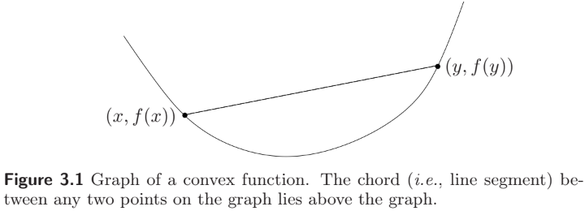
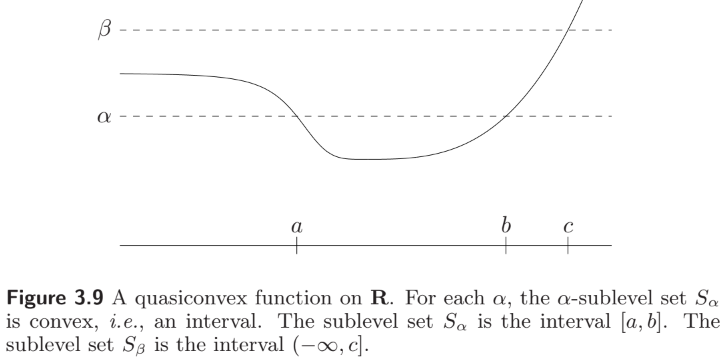
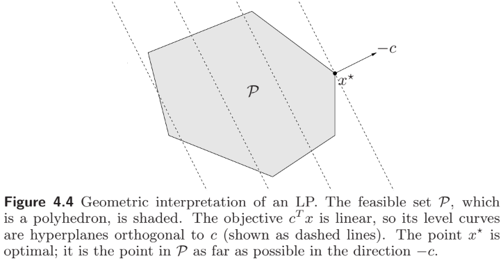
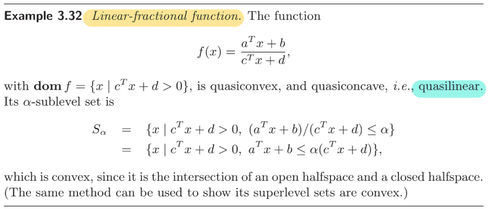
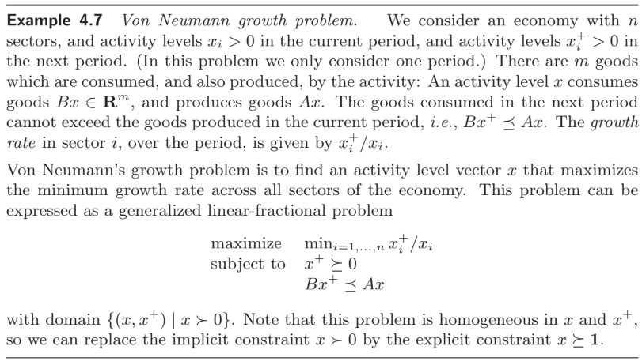
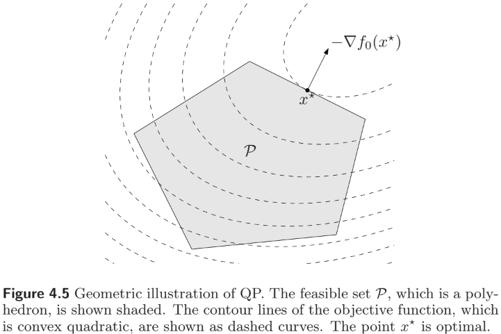
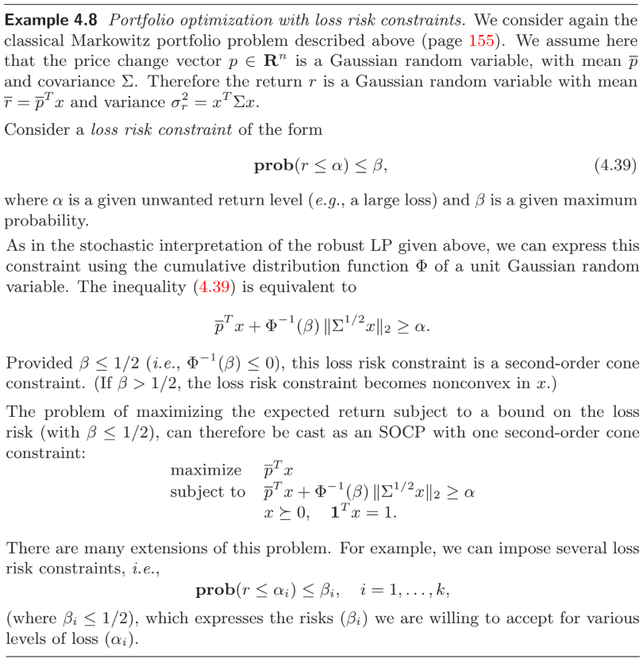

# Convex Optimization

**Stephen Boyd** (https://en.wikipedia.org/wiki/Stephen_P._Boyd)

- Samsung Professor of Engineering, Professor in Electrical Engineering, and professor by courtesy in Computer Science and Management Science & Engineering at Stanford University

**Lieven Vandenberghe**

- Professor of Electrical and Computer Engineering Department and Department of Mathematics at University of California, Los Angeles

**References**

- **Convex Optimization** (2004)
  - Cambridge University Press, https://web.stanford.edu/~boyd/cvxbook/

## Chapter 4. Convex optimization problems

##### Notation

- $\mathbf{R}=\mathbb{R}$, the set of real numbers
- $\mathbf{R}_+=\mathbb{R}_{\geq 0}$, the set of nonnegative real numbers
- $\mathbf{R}_{++}=\mathbb{R}_{>0}$​, , the set of positive real numbers
- $\mathbf{R}^{m\times n}=\mathbb{R}^{m\times n}$, the set of $m\times n$​ real matrices
- $\mathbf{S}^n=\mathbb{R}^{n\times n}_\text{sym}$, the set of symmetric $n\times n$ real matrices
- $\mathbf{S}^n_+=\mathbb{R}^{n\times n}_{\succeq 0}$, the set of (symmetric) positive semidefinite $n\times n$ real matrices
- $\mathbf{S}^n_{++}=\mathbb{R}^{n\times n}_{\succ 0}$, the set of (symmetric) positive definite $n\times n$ real matrices

### 4.1 Optimization problems

#### 4.1.1 Basic terminology

An **optimization problem** in **standard form** is one of the form
$$
\begin{align*}
\text{minimize}  &\qquad f_0(x) \\
\text{subject to} &\qquad f_i(x)\leq 0, \quad 1\leq i\leq m \\
&\qquad h_j(x)=0, \quad 1\leq j\leq p.
\end{align*} \tag{4.1}
$$
The set of points for which the objective and all constraint functions are defined is called the **domain** $\mathcal{D}$ of (4.1).

A point $x\in\mathcal{D}$ is called **feasible** if $f_i(x)\leq 0$ and $h_j(x)=0$ for all $i,j$. The set of all feasible points is the **feasible set**.

The **optimal value** of (4.1) is defined as
$$
p^*=\inf\{f_0(x)\mid \text{$x$ is feasible}\}\in\mathbb{R}\cup\{\pm\infty\}
$$
(following $\inf\varnothing=\infty$). If there are feasible solutions $x_k$ with $f_0(x_k)\to-\infty$ as $k\to\infty$, then $p^*=-\infty$ and we say (4.1) is **unbounded below**.

A <u>feasible point</u> $x^*$ is called **optimal** if $f_0(x^*)=p^*$. The set of all optimal points is the **optimal set**. If there exists an optimal point for (4.1)​, we say the optimal value is **achieved**, and the problem is **solvable**.

A <u>feasible point</u> $x$ is called $\epsilon$-**suboptimal** if $f_0(x)\leq p^*+\epsilon$ for $\epsilon>0$. The set of all $\epsilon$-suboptimal points is the $\epsilon$-**suboptimal set**.

A <u>feasible point</u> $x$ is called **locally optimal** if there is an $R>0$ such that
$$
f_0(x) = \inf\{f_0(z)\mid\text{$z$ is feasible, $\|z-x\|_2\leq R$}\}.
$$

<figure style="text-align: left; padding-top: .5em; padding-bottom: .5em;">
  
</figure>

If $f_0(x)\equiv 0$, the optimal value is either 0 (if the feasible set is nonempty) or $\infty$ (if the feasible set is empty). We call this the **feasibility problem**
$$
\begin{align*}
\text{find}  &\qquad x \\
\text{subject to} &\qquad f_i(x)\leq 0, \quad 1\leq i\leq m \\
&\qquad h_j(x)=0, \quad 1\leq j\leq p.
\end{align*}
$$

#### 4.1.2 Expressing problems in standard form

<figure style="text-align: left; padding-top: .5em; padding-bottom: .5em;">
  
</figure>
We can solve the **maximization problem**
$$
\begin{align*}
\text{maximize}  &\qquad f_0(x) \\
\text{subject to} &\qquad f_i(x)\leq 0, \quad 1\leq i\leq m \\
&\qquad h_j(x)=0, \quad 1\leq j\leq p
\end{align*} \tag{4.2}
$$
by minimizing $-f_0(x)$​ subject to the constraints. The **optimal value** of (4.2) is defined as
$$
p^* = \sup\{f_0(x)\mid\text{$x$ is feasible}\}\in\mathbb{R}\cup\{\pm\infty\}
$$
and a <u>feasible point</u> $x$ is $\epsilon$-**suboptimal** if $f_0(x)\geq p^*-\epsilon$ for $\epsilon>0$.

#### 4.1.3 Equivalent problems

##### Change of variables

Suppose $\phi\colon\mathbb{R}^n\to\mathbb{R}^n$ is <u>one-to-one</u>, with image covering $\mathcal{D}$. Then the problem
$$
\begin{align*}
\text{minimize}  &\qquad \tilde f_0(z)\equiv f_0(\phi(z)) \\
\text{subject to} &\qquad \tilde f_i(z)\equiv f_i(\phi(z))\leq 0, \quad 1\leq i\leq m \\
&\qquad \tilde h_j(z)\equiv h_j(\phi(z))=0, \quad 1\leq j\leq p
\end{align*} \tag{4.4}
$$
and (4.1) are <u>equivalent</u>: If $x$ solves (4.1) then $z=\phi^{-1}(x)$ solves (4.4); if $z$ solves (4.4) then $x=\phi(z)$​ solves (4.1).

##### Transformation of objective and constraint functions

Suppose $\psi_0\colon\mathbb{R}\to\mathbb{R}$ is <u>monotone increasing</u> on the image of $f_0$, and $\psi_i\colon\mathbb{R}\to\mathbb{R}$ satisfy $\psi_i(u)\leq 0 \Leftrightarrow u\leq 0$ and $\xi_j\colon\mathbb{R}\to\mathbb{R}$ satisfy $\xi_j(u)=0 \Leftrightarrow u=0$. Then the problem
$$
\begin{align*}
\text{minimize}  &\qquad \tilde f_0(x)\equiv \psi_0(f_0(x)) \\
\text{subject to} &\qquad \tilde f_i(x)\equiv \psi_i(f_i(x))\leq 0, \quad 1\leq i\leq m \\
&\qquad \tilde h_j(x)\equiv \xi_j(h_j(x))=0, \quad 1\leq j\leq p
\end{align*}
$$
and (4.1) are <u>equivalent</u>: The feasible sets are identical, and the optimal points are identical.

<figure style="text-align: left; padding-top: .5em; padding-bottom: .5em;">
  
</figure>

##### Slack variables

Notice that $f_i(x)\leq 0$ <u>if and only if</u> there is an $s_i\geq 0$ such that $f_i(x)+s_i=0$. The new variable $s_i$ is called the **slack variable** associated with $f_i(x)\leq 0$. Then the problem
$$
\begin{align*}
\text{minimize}  &\qquad f_0(x) \\
\text{subject to} &\qquad s_i\geq 0, \quad 1\leq i\leq m \\
&\qquad f_i(x)+s_i= 0, \quad 1\leq i\leq m \\
&\qquad h_j(x)=0, \quad 1\leq j\leq p
\end{align*} \tag{4.7}
$$
is <u>equivalent</u> to (4.1).

##### Eliminating equality constraints

If we can <u>explicitly parametrize</u> all solutions of $h_j(x)=0$ using some parameter $z\in\mathbb{R}^k$​, then we can eliminate $h_j(x)=0$ from the problem, as follows.

Suppose $\phi\colon\mathbb{R}^k\to\mathbb{R}^n$ is such that $x\in\mathbb{R}^n$ satisfies $h_j(x)=0$ for all $1\leq j\leq p$ <u>if and only if</u> there is some $z\in\mathbb{R}^k$ with $x=\phi(z)$. Then the problem
$$
\begin{align*}
\text{minimize}  &\qquad f_0(\phi(z)) \\
\text{subject to} &\qquad f_i(\phi(z))\leq 0, \quad 1\leq i\leq m
\end{align*}
$$
is <u>equivalent</u> to (4.1).

##### Eliminating linear equality constraints

The process of eliminating variables can be described more explicitly <u>when the equality constraints are all linear</u>, i.e., $Ax=b$ for some $A\in\mathbb{R}^{p\times n}$.

Assume that the original problem (4.1) is feasible, and let $x_0\in\mathbb{R}^n$ such that $Ax_0=b$.

Let $F\in\mathbb{R}^{n\times k}$ be a matrix of which the columns are a basis of the null space $\mathcal{N}(A)$. Then the general solution of $Ax=b$ is given by $Fz+x_0$ for $z\in\mathbb{R}^k$. Note that $x\in\mathcal{N}(A)$, i.e., $Ax=0$ <u>if and only if</u> there is some $z\in\mathbb{R}^k$ with $Fz=x$. Then the problem
$$
\begin{align*}
\text{minimize}  &\qquad f_0(Fz+x_0) \\
\text{subject to} &\qquad f_i(Fz+x_0)\leq 0, \quad 1\leq i\leq m
\end{align*}
$$
is <u>equivalent</u> to (4.1).

##### Introducing equality constraints

Consider the problem
$$
\begin{align*}
\text{minimize}  &\qquad f_0(A_0x+b_0) \\
\text{subject to} &\qquad f_i(A_ix+b_i)\leq 0, \quad 1\leq i\leq m \\
&\qquad h_j(x)=0, \quad 1\leq j\leq p
\end{align*}
$$
where $A_i\in\mathbb{R}^{k_i\times n}$ and $f_i\colon\mathbb{R}^{k_i}\to\mathbb{R}$. In this problem the objective and inequality constraints are given as compositions of $f_i$ with <u>affine transformations</u> $A_ix+b_i$. 

We introduce new variables $y_i\in\mathbb{R}^{k_i}$, as well as new equality constraints $y_i=A_ix+b_i$ for $0\leq i\leq m$, and form the <u>equivalent</u> problem
$$
\begin{align*}
\text{minimize}  &\qquad f_0(y_0) \\
\text{subject to} &\qquad f_i(y_i)\leq 0, \quad 1\leq i\leq m \\
&\qquad y_i=A_ix+b_i, \quad 0\leq i\leq m \\
&\qquad h_j(x)=0, \quad 1\leq j\leq p.
\end{align*}
$$
This problem has $\sum_{i=0}^m k_i$ new variables and $\sum_{i=0}^m k_i$ new equality constraints. However, the objective ($y_0$) and inequality constraints ($y_1,\dotsc,y_m$) are <u>independent</u>, i.e., involve different optimization variables.

##### Optimizing over some variables

Suppose $x\in\mathbb{R}^n$ is partitioned as $x=(x_1,x_2)$ with $x_i\in\mathbb{R}^{n_i}$ and $n_1+n_2=n$. Consider the problem
$$
\begin{align*}
\text{minimize}  &\qquad f_0(x_1,x_2) \\
\text{subject to} &\qquad f_i(x_1)\leq 0, \quad 1\leq i\leq m_1 \\
&\qquad \tilde f_i(x_2)\leq 0, \quad 1\leq i\leq m_2.
\end{align*} \tag{4.9}
$$
Define $\tilde f_0(x_1)=\inf\{f_0(x_1,z)\mid\tilde f_i(z)\leq 0\text{ for $1\leq i\leq m_2$}\}$. The problem (4.9) is then <u>equivalent</u> to
$$
\begin{align*}
\text{minimize}  &\qquad \tilde f_0(x_1) \\
\text{subject to} &\qquad f_i(x_1)\leq 0, \quad 1\leq i\leq m_1.
\end{align*} \tag{4.10}
$$

<figure style="text-align: left; padding-top: .5em; padding-bottom: .5em;">
  
</figure>

##### Epigraph problem form

The epigraph form of (4.1) is the problem
$$
\begin{align*}
\text{minimize}  &\qquad t \\
\text{subject to} &\qquad f_0(x)-t\leq 0 \\
&\qquad f_i(x)\leq 0, \quad 1\leq i\leq m \\
&\qquad h_j(x)=0, \quad 1\leq j\leq p
\end{align*} \tag{4.11}
$$
which is <u>equivalent</u> to (4.1): $(x,t)$ is optimal for (4.11) <u>if and only if</u> $x$ is optimal for (4.1) and $t=f_0(x)$. Note that the objective function of (4.11) is linear.

#### 4.1.4 Parameter and oracle problem descriptions

##### Parameter problem description

The objective and constraint functions have some analytical or closed form, i.e., are given by a formula or expression that involves the variable $x$​ as well as some <u>parameters</u>.

For example, $f_0(x)=\frac{1}{2}x^TPx+q^Tx+r$. Here, $P\in\mathbb{R}^{n\times n}_\text{sym}$, $q\in\mathbb{R}^n$ and $r\in\mathbb{R}$ are problem parameters.

##### Oracle problem description

The objective and constraint functions are described by <u>oracle models</u> (which are also called <u>black box</u> or <u>subroutine models</u>).

In an oracle model, we do not know $f$ explicitly, but can evaluate $f(x)$ (and usually also some derivatives). This is referred to as <u>querying the oracle</u>, and is usually associated with some cost, such as time.

### 4.2 Convex optimization

> A function $f\colon\mathbb{R}^n\to\mathbb{R}$ is **convex** if $\operatorname{Dom}f$ is a <u>convex set</u> and
> $$
> f(\theta x + (1-\theta)y) \leq \theta f(x) + (1-\theta)f(y) \tag{3.1}
> $$
> for all $x,y\in\operatorname{Dom}f$ and $\theta\in[0,1]$​.
>
> 
>
> A function $f$ is **strictly convex** if strict inequality holds in (3.1) whenever $x\neq y$ and $\theta\in[0,1]$. We say $f$ is **concave** if $-f$ is convex, and **strictly concave** if $-f$​​ is strictly convex.

> The $\alpha$-**sublevel set** of a function $f\colon\mathbb{R}^n\to\mathbb{R}$ is defined as
> $$
> S_\alpha = \{x\in\operatorname{Dom}f\mid f(x)\leq\alpha\}.
> $$
> <u>Sublevel sets of a convex function are convex</u>, for any $\alpha\in\mathbb{R}$. <u>The converse is not true</u>. For example, $f(x)=-e^x$ is not convex on $\mathbb{R}$ but all its sublevel sets are convex.

#### 4.2.1 Convex optimization problems in standard form

A **convex optimization problem** is one of the form
$$
\begin{align*}
\text{minimize}  &\qquad f_0(x) \\
\text{subject to} &\qquad f_i(x)\leq 0, \quad 1\leq i\leq m \\
&\qquad h_j(x)=a_j^Tx-b_j=0, \quad 1\leq j\leq p,
\end{align*} \tag{4.15}
$$
where $f_i$ are <u>convex</u> functions for all $0\leq i\leq m$​, and $h_j$ are <u>affine</u> for all $1\leq j\leq p$.

<u>We may assume without loss of generality that</u> $a_j\neq0$: If $a_j=b_j=0$, the $j$-th equality constraint can be deleted; if $a_j=0$ and $b_j\neq0$, the $j$-th equality constraint is inconsistent and the problem is infeasible.

<u>The feasible set of a convex optimization problem is convex</u>, since it is the intersection of the (convex) domain $\mathcal{D}$ with $m$ (convex) sublevel sets and $p$​ hyperplanes. Thus, we minimize a convex objective function over a convex set.

<u>The $\epsilon$-suboptimal sets are convex</u>. In particular, <u>the optimal set is convex</u>.

If the objective is <u>strictly convex</u>, the optimal set contains <u>at most one point</u>.

##### Concave maximization problems

$$
\begin{align*}
\text{maximize}  &\qquad f_0(x) \\
\text{subject to} &\qquad f_i(x)\leq 0, \quad 1\leq i\leq m \\
&\qquad h_j(x)=a_j^Tx-b_j=0, \quad 1\leq j\leq p,
\end{align*} \tag{4.16}
$$

where $f_0$ is <u>concave</u> and $f_i$ are <u>convex</u> for all $1\leq i\leq m$. This problem can be solved by minimizing $-f_0$.

#### 4.2.2 Local and global optima

A fundamental property of convex optimization problems is that <u>any locally optimal point is also (globally) optimal</u>.

> _Proof._ Suppose $x$ is <u>locally optimal</u>, i.e., $x$ is feasible and for some $R>0$,
> $$
> f_0(x) = \inf\{f_0(z)\mid\text{$z$ is feasible, $\|z-x\|_2\leq R$}\}. \tag{4.19}
> $$
> Now suppose $x$ is <u>not globally optimal</u>. Then there is a feasible $y$ such that $f_0(y)<f_0(x)$ and $\|y-x\|>R$. Consider the point $z$ given by
> $$
> z = (1-\theta)x + \theta y \quad\text{where }\theta = \frac{R}{2\|y-x\|_2}.
> $$
> Then $z$ is feasible and $\|z-x\|_2=\frac{R}{2}<R$, so $f_0(x)\leq f_0(z)$. However,
> $$
> f_0(z) \leq (1-\theta)f_0(x)+\theta f_0(y) < f_0(x),
> $$
> which contradicts (4.19). Hence, $x$ is globally optimal.

#### 4.2.3 An optimality criterion for differentiable $f_0$​

>##### First-order conditions for convexity
>
>Suppose $f$ is differentiable. Then $f$ is convex <u>if and only if</u> $\operatorname{Dom}f$ is convex and
>$$
>f(y) \geq f(x) + \nabla f(x)^T(y-x) \tag{4.20}
>$$
>holds for all $x,y\in\operatorname{Dom}f$ (see $\S$3.1.3).

Suppose that the objective $f_0$ in a convex optimization problem is <u>differentiable</u>. Then $x$ is optimal <u>if and only if</u> $x$ is feasible and
$$
\nabla f_0(x)^T(y-x) \geq 0 \quad\text{for all feasible $y$}. \tag{4.21}
$$

> _Proof._ ($\Leftarrow$) If $x$ is feasible and satisfies (4.21), then $f_0(y)-f_0(x)=\nabla f_0(x)^T(y-x)\geq 0$ for all feasible $y$. Thus $x$ is optimal.
>
> ($\Rightarrow$) Suppose $x$ is optimal, but (4.21) <u>does not hold</u>, i.e., $\nabla f_0(x)^T(y-x)<0$ for some feasible $y$​. Consider the feasible path $z(t)=ty+(1-t)x$ for $t\in[0,1]$. Then for small $t>0$, we have $f_0(z(t))<f_0(x)$, since
> $$
> \frac{d}{dt}f_0(z(t))\Big|_{t=0} = \nabla f_0(x)^T(y-x) < 0.
> $$

##### Unconstrained problems

For an <u>unconstrained</u> problem, (4.21) reduces to the well-known necessary and sufficient condition
$$
\nabla f_0(x) = 0 \tag{4.22}
$$
for $x$ to be optimal​.

There are several possible situations, depending on the number of solutions of (4.22).

- If there are <u>no solutions</u> of (4.22), there are <u>no optimal points</u>; the optimal value of the problem is <u>not achieved</u>.
  1. The problem is <u>unbounded below</u>.
  2. The optimal value is <u>finite</u>, but <u>not achieved</u>.
- We can have <u>multiple solutions</u> of (4.22), in which case each such solution is a minimizer of $f_0$​.

<figure style="text-align: left; padding-top: .5em; padding-bottom: .5em;">
  
</figure>

> The **analytic center** of a polyhedron $P=\{x\mid Ax\preceq b\}$ is defined as a point inside $P$ that <u>maximizes the product of distances to the sides</u>. The distance of $x\in P$ to each side is $(b-a_i^Tx)/\|a_i\|$ so that the analytic center is $x$ which maximizes $\prod_i(b-a_i^Tx)$.

<figure style="text-align: left; padding-top: .5em; padding-bottom: .5em;">
  
</figure>

##### Problems with equality constraints only

Consider the problem
$$
\begin{align*}
\text{minimize}  &\qquad f_0(x) \\
\text{subject to} &\qquad Ax=b.
\end{align*}
$$
We assume that the (affine) feasible set is nonempty. The optimality condition (4.21) for a feasible $x$ can be expressed as
$$
\nabla f_0(x) + A^T\nu = 0 \quad\text{for some $\nu\in\mathbb{R}^p$}.
$$

> _Proof._ Let $x$ be feasible, i.e., $Ax=b$. Then every feasible $y$ has the form $y=x+v$ for some $v\in\mathcal{N}(A)$. Therefore, (4.21) can be expressed as
> $$
> \nabla f_0(x)^T(y-x)=\nabla f_0(x)^Tv\geq 0 \quad\text{for all $v\in\mathcal{N}(A)$}.
> $$
> Since $\mathcal{N}(A)$ is a subspace, $\nabla f_0(x)\perp\mathcal{N}(A)$ $\Rightarrow$ $\nabla f_0(x)\in\mathcal{N}(A)^\perp=\mathcal{R}(A^T)$.

Together with $Ax=b$ (since $x$​​ is feasible), this is the classical <u>Lagrange multiplier</u> optimality condition:
$$
f_0(x)+(Ax-b)^T\nu.
$$

##### Minimization over the nonnegative orthant (e.g. 사분면 or 팔분면)

Consider the problem
$$
\begin{align*}
\text{minimize}  &\qquad f_0(x) \\
\text{subject to} &\qquad x\succeq 0.
\end{align*}
$$
The optimality condition (4.21) can be expressed as
$$
x\succeq 0, \quad \nabla f_0(x)\succeq 0, \quad x_i(\nabla f_0(x))_i=0\text{ for $1\leq i\leq n$}.
$$

> _Proof._ Note that (4.21) can be expressed as
> $$
> x\succeq 0, \qquad \nabla f_0(x)^T(y-x)\geq 0 \quad\text{for all $y\succeq 0$}.
> $$
> The term $\nabla f_0(x)^Ty\to-\infty$ on $y\succeq 0$, unless $\nabla f_0(x)\succeq 0$. Thus the condition reduces to $-\nabla f_0(x)^Tx\geq 0$. But $x\succeq 0$ and $\nabla f_0(x)\succeq 0$, so we must have $\nabla f_0(x)^Tx=0$.

The last condition is called **complementarity**, since it means that the <u>sparsity patterns</u> (i.e., the set of indices corresponding to nonzero components) of $x$ and $\nabla f_0(x)$​ <u>are complementary</u> (i.e., have empty intersection).

#### 4.2.4 Equivalent convex problems

##### Eliminating equality constraints

For a convex problem, the equality constraints must be linear, i.e., $Ax=b$.

>In this case, recall that (4.1) is equivalent to the problem
>$$
>\begin{align*}
>\text{minimize}  &\qquad f_0(Fz+x_0) \\
>\text{subject to} &\qquad f_i(Fz+x_0)\leq 0, \quad 1\leq i\leq m,
>\end{align*}
>$$
>where $F\in\mathbb{R}^{k\times n}$ such that $\mathcal{R}(F)\subseteq\mathcal{N}(A)$.

Since <u>the composition of a convex function with an affine function is convex</u>, eliminating equality constraints <u>preserves convexity</u> of a problem.

In many cases, however, <u>it is better to retain the equality constraints</u>, since eliminating them can make the problem harder to understand and analyze, or ruin the efficiency of an algorithm that solves it.

##### Introducing equality constraints

>Consider the problem
>$$
>\begin{align*}
>\text{minimize}  &\qquad f_0(A_0x+b_0) \\
>\text{subject to} &\qquad f_i(A_ix+b_i)\leq 0, \quad 1\leq i\leq m \\
>&\qquad h_j(x)=0, \quad 1\leq j\leq p
>\end{align*}
>$$
>We introduce new variables $y_i\in\mathbb{R}^{k_i}$, as well as new equality constraints $y_i=A_ix+b_i$ for $0\leq i\leq m$, and form the <u>equivalent</u> problem
>$$
>\begin{align*}
>\text{minimize}  &\qquad f_0(y_0) \\
>\text{subject to} &\qquad f_i(y_i)\leq 0, \quad 1\leq i\leq m \\
>&\qquad y_i=A_ix+b_i, \quad 0\leq i\leq m \\
>&\qquad h_j(x)=0, \quad 1\leq j\leq p.
>\end{align*}
>$$

If we introduce new variables and <u>linear equality constraints</u> into a convex optimization problem, the resulting problem will also be <u>convex</u>.

##### Slack variables

>The slack variables $s_i$ associated with $f_i(x)\leq 0$ give the equivalent problem
>$$
>\begin{align*}
>\text{minimize}  &\qquad f_0(x) \\
>\text{subject to} &\qquad s_i\geq 0, \quad 1\leq i\leq m \\
>&\qquad f_i(x)+s_i= 0, \quad 1\leq i\leq m \\
>&\qquad h_j(x)=0, \quad 1\leq j\leq p.
>\end{align*}
>$$

Since equality constraint must be affine in a convex problem, we must have $f_i$ <u>affine</u> for $1\leq i\leq m$.

##### Epigraph problem form

>The epigraph form of (4.1) is the problem
>$$
>\begin{align*}
>\text{minimize}  &\qquad t \\
>\text{subject to} &\qquad f_0(x)-t\leq 0 \\
>&\qquad f_i(x)\leq 0, \quad 1\leq i\leq m \\
>&\qquad h_j(x)=0, \quad 1\leq j\leq p.
>\end{align*}
>$$

The objective is linear (hence convex) and the new constraint $f_0(x)-t$​ is also convex, so <u>the epigraph form problem is convex</u> as well.

The <u>epigraph form</u> of a convex problem <u>has several practical uses</u>. We can simplify theoretical analysis. It can also simplify algorithm development.

##### Minimizing over some variables

> Suppose $x\in\mathbb{R}^n$ is partitioned as $x=(x_1,x_2)$ with $x_i\in\mathbb{R}^{n_i}$ and $n_1+n_2=n$. Consider the problem
> $$
> \begin{align*}
> \text{minimize}  &\qquad f_0(x_1,x_2) \\
> \text{subject to} &\qquad f_i(x_1)\leq 0, \quad 1\leq i\leq m_1 \\
> &\qquad \tilde f_i(x_2)\leq 0, \quad 1\leq i\leq m_2.
> \end{align*} \tag{4.9}
> $$
> Define $\tilde f_0(x_1)=\inf\{f_0(x_1,z)\mid\tilde f_i(z)\leq 0\text{ for $1\leq i\leq m_2$}\}$. The problem (4.9) is then <u>equivalent</u> to
> $$
> \begin{align*}
> \text{minimize}  &\qquad \tilde f_0(x_1) \\
> \text{subject to} &\qquad f_i(x_1)\leq 0, \quad 1\leq i\leq m_1.
> \end{align*} \tag{4.10}
> $$

> If $f$ is convex in $(x,y)$, and $C$ is a convex nonempty set, then $g(x)=\inf_{y\in C}f(x,y)$ is convex in $x$, provided $g(x)>-\infty$ for all $x$, (see $\S$3.2.5).

Minimizing a convex function over some variables preserves convexity. Therefore, if $f_0$ in (4.9) is <u>convex</u> in $(x_1,x_2)$, and $f_i$ and $\tilde f_i$ are <u>convex</u>, then the equivalent problem (4.10) is <u>convex</u>.

#### 4.2.5 Quasiconvex optimization

> A function $f\colon\mathbb{R}\to\mathbb{R}$ is called **quasiconvex** if its domain and all its sublevel sets $S_\alpha=\{x\in\operatorname{Dom}f\mid f(x)\leq\alpha\}$ for $\alpha\in\mathbb{R}$​​ are convex.
>
> 
>
> A function is **quasiconcave** if $-f$ is quasiconvex. A function that is both quasiconvex and quasiconcave is called **quasilinear**.

If the objective $f_0$ in a convex optimization problem (4.15) is <u>quasiconvex</u>, we have a (standard form) **quasiconvex optimization problem**
$$
\begin{align*}
\text{minimize}  &\qquad f_0(x) \\
\text{subject to} &\qquad f_i(x)\leq 0, \quad 1\leq i\leq m \\
&\qquad Ax=b,
\end{align*} \tag{4.24}
$$
where $f_0$ is <u>quasiconvex</u> and $f_i$ are <u>convex</u> for $1\leq i\leq m$.

In a similar way, if $f_0$ in a concave optimization problem (4.16) is <u>quasiconcave</u>, we have a (standard form) **quasiconcave optimization problem**
$$
\begin{align*}
\text{maximize}  &\qquad f_0(x) \\
\text{subject to} &\qquad f_i(x)\leq 0, \quad 1\leq i\leq m \\
&\qquad Ax=b,
\end{align*}
$$
where $f_0$ is <u>quasiconcave</u> and $f_i$ are <u>convex</u> for $1\leq i\leq m$.

<u>The $\epsilon$-suboptimal sets are also convex</u> for a quasiconvex optimization problem. In particular, <u>the optimal set is convex</u>.

##### Locally optimal solutions and optimality conditions

A quasiconvex optimization problem can have <u>locally optimal solutions that are not (globally) optimal</u>.

> ##### First-order conditions for quasiconvexity
>
> A <u>differentiable</u> function $f\colon\mathbb{R}^n\to\mathbb{R}$ with <u>convex domain</u> is quasiconvex <u>if and only if</u>
> $$
> f(y)\leq f(x) \implies \nabla f(x)^T(y-x)\leq 0 \quad\text{for all $x,y\in\operatorname{Dom}f$}. \tag{3.20}
> $$
> 

> In a convex optimization problem, $x$ is optimal <u>if and only if</u> $x$ is feasible and
> $$
> \nabla f_0(x)^T(y-x) \geq 0 \quad\text{for all feasible $y$} \tag{4.21}
> $$

The first-order condition for quasiconvexity implies that $x$ is optimal <u>if</u> $x$ is feasible and
$$
\nabla f_0(x)^T(y-x)>0 \quad\text{for all $y\neq x$ feasible}. \tag{4.25}
$$

- (4.25) is <u>only sufficient</u> for optimality, whereas (4.21) is necessary and sufficient.
- (4.25) requires $\nabla f_0\neq 0$, whereas (4.21) does not. 

##### Quasiconvex optimization via convex feasibility problems

> If $f$ is quasiconvex, there exists a <u>family of convex functions</u> $\phi_t$ such that
> $$
> f(x)\leq t \iff \phi_t(x)\leq 0, \tag{3.23}
> $$
> i.e., the $t$-sublevel set of $f$ is the 0-sublevel set of $\phi_t$, (see $\S$3.4.5).
>
> Such a representation <u>always exists</u>, we can take
> $$
> \phi_t(x) = \begin{cases} 0, & f(x)\leq t, \\ \infty & \text{otherwise}. \end{cases}
> $$
> However, we are usually interested in a family $\phi_t$ with nice properties, such as differentiability.
>
> <figure style="text-align: left; padding-top: .5em; padding-bottom: .5em;">
> 
> </figure>

Let $\phi_t$ be a family of convex functions that satisfy $f_0(x)\leq t\iff\phi_t(x)\leq 0$ and also $\phi_s(x)\leq\phi_t(x)$ whenever $s\geq t$.

Let $p^*$ be the optimal value of the quasiconvex optimization problem (4.24). Consider the <u>convex feasibility problem</u> for a given value $t$,
$$
\begin{align*}
\text{find}  &\qquad x \\
\text{subject to} &\qquad \phi_t(x)\leq 0 \\
&\qquad f_i(x)\leq 0, \quad 1\leq i\leq m \\
&\qquad Ax=b.
\end{align*} \tag{4.26}
$$
If (4.26) has a feasible point $x$, then $p^*\leq t$. Conversely, if (4.26) is infeasible, then $p^*\geq t$.

<figure style="text-align: left; padding-top: .5em; padding-bottom: .5em;">
  
</figure>

It follows that exactly $k=\lceil\log_2((u-l)/\epsilon)\rceil$ iterations are required before the algorithm terminates, since $\dfrac{u-l}{2^k}\leq\epsilon$.

### 4.3 Linear optimization problems

If the objective and all constraint functions are <u>affine</u>, the problem is called a **linear program (LP)**. A <u>general linear program</u> has the form
$$
\begin{align*}
\text{minimize} &\qquad c^Tx + d \\
\text{subject to} &\qquad Gx \succeq h \\
&\qquad Ax=b,
\end{align*} \tag{4.27}
$$
where $G\in\mathbb{R}^{m\times n}$ and $A\in\mathbb{R}^{p\times n}$. Linear programs are, of course, convex optimization problems.

It is common to <u>omit the constant</u> $d$ in the objective function, since it does not affect the optimal set.

##### Standard and inequality form linear programs

In a **standard form LP**
$$
\begin{align*}
\text{minimize} &\qquad c^Tx \\
\text{subject to} &\qquad Ax=b \\
&\qquad x\succeq 0.
\end{align*} \tag{4.28}
$$
If the LP has <u>no equality constraints</u>, it is called an **inequality form LP**
$$
\begin{align*}
\text{minimize} &\qquad c^Tx \\
\text{subject to} &\qquad Ax\preceq b.
\end{align*} \tag{4.29}
$$

##### Converting LPs to standard form

It is sometimes useful to transform (4.27) to (4.28).

1. Introduce <u>slack variables</u> $s_i$ for the inequalities, which results in
   $$
   \begin{align*}
   \text{minimize} &\qquad c^Tx +d \\
   \text{subject to} &\qquad Gx+s=h \\
   &\qquad Ax=b \\
   &\qquad s\succeq 0.
   \end{align*}
   $$

2. Express $x=x^+-x^-$ for $x^+,x^-\in\mathbb{R}_{\geq0}$. This yields an LP in standard form.
   $$
   \begin{align*}
   \text{minimize} &\qquad c^Tx^+ - c^Tx^- + d \\
   \text{subject to} &\qquad Gx^+ - Gx^- + s = h \\
   &\qquad Ax^+ - Ax^- = b \\
   &\qquad x^+\succeq 0, \quad x^-\succeq 0, \quad s\succeq 0.
   \end{align*}
   $$

#### 4.3.1 Examples

##### Diet problem

A healthy diet contains $m$ <u>different nutrients</u> in quantities at least equal to $b_1\dotsc,b_m$. We can compose such a diet by choosing nonnegative quantities $x_1,\dotsc,x_n$ of $n$ <u>different foods</u>. One unit quantity of food $j$ contains an amount $a_{ij}$ of nutrient $i$, and has a cost of $c_j$.

We want to determine the <u>cheapest diet</u> that satisfies the nutritional requirements. The problem can be formulated as the LP
$$
\begin{align*}
\text{minimize} &\qquad c^Tx \\
\text{subject to} &\qquad Ax\succeq b \\
&\qquad x\succeq 0.
\end{align*}
$$

##### Chebyshev center of a polyhedron

Consider the problem of finding the <u>largest Euclidean ball</u> (e.g., 내접원) that lies in a polyhedron
$$
\mathcal{P}=\{x\in\mathbb{R}^n\mid a_i^Tx\leq b_i,\,1\leq i\leq m\}.
$$
The center of the optimal ball (called the **Chebyshev center** of $\mathcal{P}$) can be determined by solving the LP
$$
\begin{align*}
\text{maximize} &\qquad r \\
\text{subject to} &\qquad a_i^Tx_c + r\|a_i\|_2\leq b_i, \quad 1\leq i\leq m.
\end{align*}
$$

> _Proof._ The constraint $\{x_c+u\mid \|u\|_2\leq r\}\subseteq\mathcal{P} $, i.e., $\|u\|_2\leq r \Rightarrow a_i^T(x_c+u)\leq b_i$ can be written as
> $$
> a_i^Tx_c+\sup\{a_i^Tu\mid \|u\|_2\leq r\}=a_i^Tx_c+r\|a_i\|_2\leq b_i.
> $$

##### Dynamic activity planning (skip)

##### Chebyshev inequalities

Consider a <u>probability distribution</u> $p\in\mathbb{R}^n$ for a <u>discrete random variable</u> $x$ on $\{u_1,\dotsc,u_n\}\subseteq\mathbb{R}$, where $p_k=\operatorname{prob}(x=u_k)$. Then $p\succeq 0$ and $\mathbf{1}^T p=1$. Conversely, if $p\in\mathbb{R}^n$ satisfies $p\succeq 0$ and $\mathbf{1}^T p=1$, it defines a probability distribution for $x$.

Suppose we know <u>upper and lower bounds</u> on $\mathbb{E}[f_i]=\sum_k p_kf_i(u_k)$ for some functions $f_i$ of $x$. It can be expressed as linear inequality constraints on $p$,
$$
\alpha_i \leq a_i^Tp \leq \beta_i, \quad 1\leq i\leq m.
$$
<u>The problem is to give lower and upper bounds</u> on $\mathbb{E}[f_0]=a_0^Tp$, where $f_0$ is some function of $x$. The optimal value of the LP
$$
\begin{align*}
\text{minimize} &\qquad a_0^Tp \\
\text{subject to} &\qquad p\succeq 0, \quad \mathbf{1}^Tp=1 \\
&\qquad \alpha_i \leq a_i^Tp \leq \beta_i, \quad 1\leq i\leq m.
\end{align*}
$$
gives the lowest possible value of $\mathbb{E}[f_0]$ for any distribution. Moreover, the bound is sharp: The optimal solution achieves the lower bound. In a similar way, we can find the best upper bound by maximizing $a_0^Tp$ subject to the same constraints.

##### Piecewise-linear minimization

Consider the (unconstrained) <u>problem of minimizing the piecewise-linear, convex function</u>
$$
f(x) = \max_{1\leq i\leq m} (a_i^Tx+b_i).
$$
This problem can be transformed to an equivalent LP (the epigraph problem)
$$
\begin{align*}
\text{minimize} &\qquad t \\
\text{subject to} &\qquad a_i^Tx+b_i\leq t, \quad 1\leq i\leq m.
\end{align*}
$$

#### 4.3.2 Linear-fractional programming

The problem of <u>minimizing a ratio of affine functions over a polyhedron</u> is called a **linear-fractional problem**
$$
\begin{align*}
\text{minimize} &\qquad f_0(x) \\
\text{subject to} &\qquad Gx\preceq h \\
&\qquad Ax=b
\end{align*} \tag{4.32}
$$
where $f_0(x)=\dfrac{c^Tx+d}{e^Tx+f}$ and $\operatorname{Dom}f_0=\{x\mid e^Tx+f>0\}$​​.

> <figure style="text-align: left; padding-top: .5em; padding-bottom: .5em;">
> 
> </figure>

The objective function $f_0$​ is quasiconvex (in fact, quasilinear) so (4.32) is a <u>quasiconvex optimization problem</u>.

##### Transforming to a linear program

If the feasible set $\{x\mid Gx\preceq h,\,Ax=b,\,e^Tx+f>0\}\neq\varnothing$, then (4.32) can be transformed to an equivalent LP
$$
\begin{align*}
\text{minimize} &\qquad c^Ty+dz \\
\text{subject to} &\qquad Gy-hz\preceq 0 \\
&\qquad Ay-bz = 0 \\
&\qquad e^Ty+fz = 1 \\
&\qquad z\geq 0.
\end{align*} \tag{4.33}
$$

> _Proof._ Let $p^*$ and $q^*$ be the optimal value of (4.32) and (4.33), respectively. Then $p^*=q^*$.
>
> ($p^*\geq q^*$) If $x$ is feasible in (4.32), then the pair $y=\dfrac{x}{e^Tx+f}$ and $z=\dfrac{1}{e^Tx+f}>0$ is feasible in (4.33) with the same objective value $c^Ty+dz=f_0(x)$.
>
> ($p^*\leq q^*$) Suppose $(y,z)$ is feasible in (4.33). If $z\neq 0$, then $x=y/z$ is feasible in (4.32) with the same objective value $f_0(x)=c^Ty+dz$. On the other hands, if $z=0$, let $x_0$ is a feasible for (4.32). Then $x=x_0+ty$ is feasible in (4.32) for all $t\geq 0$. Moreover, $\lim_{t\to\infty}f_0(x_0+ty)=c^Ty/e^Ty=c^Ty+dz$, since $e^Ty+fz=1$ and $z=0$. Thus we can find feasible points in (4.32) with objective values arbitrarily close to the objective value of $(y,z)$​.

##### Generalized linear-fractional programming

A generalization of (4.32) is the **generalized linear-fractional program** in which
$$
f_0(x) = \max_{1\leq i\leq r}\frac{c_i^Tx+d_i}{e_i^Tx+f_i}, \quad \operatorname{Dom}f_0 = \{x\mid e_i^Tx+f_i>0\text{ for $1\leq i\leq r$}\}.
$$
The objective function $f_0(x)$ is the pointwise maximum of $r$​​ quasiconvex functions, and therefore quasiconvex, so this problem is quasiconvex.

> A <u>nonnegative weighted maximum of quasiconvex functions</u>, i.e., $f=\max\{w_1f_1,\dotsc,w_mf_m\}$ with $w_i\geq0$ and $f_i$ quasiconvex, <u>is quasiconvex</u>, (see $\S$3.4.4.)
>
> ($\because$) The $\alpha$-sublevel set of $f$ is the intersection of the $\alpha$-sublevel sets of $w_if_i$.

<figure style="text-align: left; padding-top: .5em; padding-bottom: .5em;">

</figure>

### 4.4 Quadratic optimization problems

The convex optimization problem (4.15) is called a **quadratic program (QP)** if the objective $f_0$​ is (convex) <u>quadratic</u>, and the constraint functions are <u>affine</u>.
$$
\begin{align*}
\text{minimize} &\qquad \tfrac{1}{2}x^TPx + q^Tx + r \\
\text{subject to} &\qquad Gx \preceq h \\
&\qquad Ax=b,
\end{align*} \tag{4.34}
$$
where $P\in\mathbb{R}^{n\times n}_{\succeq 0}$, $G\in\mathbb{R}^{m\times n}$, and $A\in\mathbb{R}^{p\times n}$​.

If the objective in (4.15) as well as the inequality constraint functions are (convex) quadratic, the problem is called a **quadratically constrained quadratic program (QCQP)**.
$$
\begin{align*}
\text{minimize} &\qquad \tfrac{1}{2}x^TP_0x + q_0^Tx + r_0 \\
\text{subject to} &\qquad \tfrac{1}{2}x^TP_ix + q_i^Tx + r_i \leq 0, \quad 1\leq i\leq m \\
&\qquad Ax=b,
\end{align*} \tag{4.35}
$$
where $P_i\in\mathbb{R}^{n\times n}_{\succeq 0}$ and $A\in\mathbb{R}^{p\times n}$​. Notice that **LP** $\subset$ **QP** $\subset$ **QCQP**.

#### 4.4.1 Examples

##### Least-squares and regression

The problem of minimizing
$$
\|Ax-b\|_2^2=x^TA^TAx-2b^TAx+b^Tb
$$
is an (unconstrained) QP (called **regression analysis** or **least-squares approximation**), which has the <u>well known analytical solution</u> $x=A^\dagger b$, where $A^\dagger$ is the pseudo-inverse of $A$.

When linear inequality constraints are added (called **constrained regression** or **constrained least-square**), there is <u>no longer a simple analytical solution</u>. As an example of QP,
$$
\begin{align*}
\text{minimize} &\qquad \|Ax-b\|_2^2 \\
\text{subject to} &\qquad l_i\leq x_i\leq u_i, \quad 1\leq i\leq n.
\end{align*}
$$

##### Distance between polyhedra

The (Euclidean) distance between the two polyhedra $\mathcal{P}_i=\{x\in\mathbb{R}^n\mid A_ix\preceq b_i\}$ for $i=1,2$ is defined as
$$
\operatorname{dist}(\mathcal{P}_1,\mathcal{P}_2) = \inf\bigl\{\|x_1-x_2\|_2\bigm| x_i\in\mathcal{P}_i\text{ for $i=1,2$}\bigr\}.
$$
To find $\operatorname{dist}(\mathcal{P}_1,\mathcal{P}_2)$, we can solve the QP
$$
\begin{align*}
\text{minimize} &\qquad \|x_1-x_2\|_2^2 \\
\text{subject to} &\qquad A_ix_i\preceq b_i, \quad i=1,2.
\end{align*}
$$
This problem is infeasible <u>if and only if</u> one of $\mathcal{P}_i=\varnothing$.

The optimal value is zero <u>if and only if</u> $\mathcal{P}_1\cap\mathcal{P}_2\neq\varnothing$, in which case the optimal $x_1=x_2\in\mathcal{P}_1\cap\mathcal{P}_2$. Otherwise the optimal $x_1\in\mathcal{P}_1$ and $x_2\in\mathcal{P}_2$ are closest to each other.

##### Bounding variance

>Consider a <u>probability distribution</u> $p\in\mathbb{R}^n$ for a <u>discrete random variable</u> $x$ on $\{u_1,\dotsc,u_n\}\subseteq\mathbb{R}$, where $p_k=\operatorname{prob}(x=u_k)$.

For a function $f$ on $x$, we have $\mathbb{E}[f]=\sum_k f_kp_k$ where $f_k=f(u_k)$, and the variance of $f$ is
$$
\operatorname{Var}[f] = \mathbb{E}[f^2] - \mathbb{E}[f]^2 = \sum_k f_k^2p_k - \Bigr(\sum_k f_kp_k\Bigl)^2,
$$
which is a <u>concave quadratic</u> function on $p$​.

We can <u>maximize the variance</u> of $f$, subject to the given prior information, by solving the QP
$$
\begin{align*}
\text{maximize} &\qquad \sum_k f_k^2p_k-\Bigl(\sum_k f_kp_k\Bigr)^2 \\
\text{subject to} &\qquad p\succeq 0, \quad \mathbf{1}^Tp=1 \\
&\qquad \alpha_i\leq a_i^Tp\leq \beta_i, \quad 1\leq i\leq m.
\end{align*}
$$

##### Linear program with random cost

We consider an LP
$$
\begin{align*}
\text{minimize} &\qquad c^Tx \\
\text{subject to} &\qquad Gx\preceq h \\
&\qquad Ax=b.
\end{align*}
$$
Suppose the cost vector $c\in\mathbb{R}^n$ is <u>random</u>, with mean value $\bar c$ and covariance $\Sigma=\mathbb{E}[(c-\bar c)(c-\bar c)^T]$​.

For $x\in\mathbb{R}^n$, the cost $c^Tx$ is a (scalar) random variable with mean $\mathbb{E}[c^Tx]=\bar c^Tx$ and variance
$$
\operatorname{Var}[c^Tx] = \mathbb{E}[(c^Tx-\mathbb{E}[c^Tx])^2] = x^T\Sigma x.
$$
In general, there is a trade-off between small expected cost and small cost variance. One way to take variance into account is to minimize a linear combination
$$
\mathbb{E}[c^Tx] + \gamma\operatorname{Var}[c^Tx] = \bar c^Tx + \gamma x^T\Sigma x
$$
which is called the **risk-sensitive cost**. The parameter $\gamma\geq 0$ is called the **risk-aversion** (or **risk-avoiding**) parameter. For $\gamma>0$, we are willing to trade off an increase in expected cost for a sufficiently large decrease in cost variance.

To minimize the risk-sensitive cost we solve the QP
$$
\begin{align*}
\text{minimize} &\qquad \bar c^Tx + \gamma x^T\Sigma x \\
\text{subject to} &\qquad Gx\preceq h \\
&\qquad Ax=b.
\end{align*}
$$

##### Markowitz portfolio optimization (skip)

We consider a classical portfolio problem with $n$ assets or stocks held over a period of time.

Let $x_i$ denote the amount of asset $i$ held throughout the period, with $x_i$ in dollars, at the price at the beginning of the period. A normal long position in asset $i$ corresponds to $x_i>0$; a short position in asset $i$ corresponds to $x_i<0$.

Let $p_i$ denote the relative price change of asset $i$ over the period. The overall return on the portfolio is $r=p^Tx$ (given in dollars). The optimization variable is the portfolio vector $x\in\mathbb{R}^n$.

We take a stochastic model for price changes: $p\in\mathbb{R}^n$ is a random vector with known mean $\bar p$ and covariance $\Sigma$. Therefore with portfolio $x\in\mathbb{R}^n$, the return $r$ is a (scalar) random variable with mean $\bar p^Tx$ and variance $x^T\Sigma x$. The choice of portfolio $x$ involves a trade-off between the mean of the return, and its variance.

The classical portfolio optimization problem, introduced by Markowitz, is the QP
$$
\begin{align*}
\text{minimize} &\qquad x^T\Sigma x \\
\text{subject to} &\qquad \bar p^Tx\geq r_\text{min} \\
&\qquad \mathbf{1}^Tx=1, \quad x\succeq 0.
\end{align*}
$$
Many extensions are possible, see p.156.

#### 4.4.2 Second-order cone programming

A problem that is closely related to QP is the **second-order cone program (SOCP)**
$$
\begin{align*}
\text{minimize} &\qquad f^Tx \\
\text{subject to} &\qquad \|A_ix+b_i\|_2 \leq c_i^Tx+d_i, \quad 1\leq i\leq m \\
&\qquad Fx=g,
\end{align*} \tag{4.36}
$$
where $A_i\in\mathbb{R}^{n_i\times n}$ and $F\in\mathbb{R}^{p\times n}$. We call a constraint of the form
$$
\|Ax+b\|_2 \leq c^Tx+d
$$
where $A\in\mathbb{R}^{k\times n}$, a **second-order cone constraint**, since it is the same as requiring the affine function $(Ax+b, c^Tx+d)$ to lie in the **second-order cone** $\mathcal{C}_{k+1}=\{(x,t)\mid x\in\mathbb{R}^k,\,t\in\mathbb{R},\,\|x\|_2\leq t\}\subseteq\mathbb{R}^{k+1}$​​.

Notice that **LP** $\subset$ **QP** $\subset$ **QCQP** $\subset$ **SOCP**. When $c_i=0$ for $1\leq i\leq m$, the SOCP (4.36) is equivalent to a QCQP. Similarly, if $A_i=0$ for $1\leq i\leq m$, the SOCP (4.36) reduces to a (general) LP.

##### Robust linear programming

We consider a LP in equality form
$$
\begin{align*}
\text{minimize} &\qquad c^Tx \\
\text{subject to} &\qquad a_i^Tx\leq b_i, \quad 1\leq i\leq m.
\end{align*}
$$
in which there is some <u>uncertainty or variation</u> in the parameters $c,a_i,b_i$.

To simplify the exposition, we assume that $c$ and $b_i$ are fixed, and that
$$
a_i \in \mathcal{E}_i=\{\bar a_i+P_iu\mid \|u\|_2\leq 1\},
$$
where $P_i\in\mathbb{R}^{n\times n}$. (If $P_i$ is singular, we obtain "flat" ellipsoids of dimension $\operatorname{rank}P_i$; $P_i=0$ means that $a_i$​ is known perfectly.)

We require that the constraints be satisfied for all possible values of the parameters $a_i$, which leads us to the **robust linear program**
$$
\begin{align*}
\text{minimize} &\qquad c^Tx \\
\text{subject to} &\qquad a_i^Tx\leq b_i \text{ for all $a_i\in\mathcal{E}_i$}, \quad 1\leq i\leq m.
\end{align*} \tag{4.37}
$$
The **robust linear constraint** can be expressed as a second-order cone constraint
$$
\begin{align*}
\sup\{a_i^Tx\mid a_i\in\mathcal{E}_i\} &= \bar a_i^Tx + \sup\{u^TP_i^Tx\mid\|u\|_2\leq 1\} \\
&= \bar a_i^Tx + \|P_i^Tx\|_2 \leq b_i.
\end{align*}
$$
Hence the robust LP (4.37) can be expressed as the SOCP
$$
\begin{align*}
\text{minimize} &\qquad c^Tx \\
\text{subject to} &\qquad \bar a_i^Tx + \|P_i^Tx\|_2\leq b_i, \quad 1\leq i\leq m.
\end{align*}
$$
Note that the additional norm terms act as **regularization terms**; they prevent $x$ from being large in directions with considerable uncertainty in the parameters $a_i$.

##### Linear programming with random constraints

The robust LP described above can also be considered in a statistical framework.

Suppose that $a_i$ are <u>independent Gaussian</u> random vectors, with mean $\bar a_i$ and covariance $\Sigma_i$. 

For $\eta\geq 0.5$, the problem
$$
\begin{align*}
\text{minimize} &\qquad c^Tx \\
\text{subject to} &\qquad \operatorname{prob}(a_i^Tx \leq b_i) \geq \eta, \quad 1\leq i\leq m
\end{align*}
$$
can be expressed as the SOCP
$$
\begin{align*}
\text{minimize} &\qquad c^Tx \\
\text{subject to} &\qquad \bar a_i^Tx + \Phi^{-1}(\eta)\|\Sigma_i^{1/2}x\|_2 \leq b_i, \quad 1\leq i\leq m,
\end{align*}
$$
where $\Phi(z)$ is the cumulative distribution of a zero mean unit variance Gaussian random variable. Note that $\Phi^{-1}(\eta)\geq 0$ by assumption that $\eta\geq 0.5$. (See p.158 for proof.)

<figure style="text-align: left; padding-top: .5em; padding-bottom: .5em;">

</figure>

##### Minimal surface

Consider a differentiable function $f\colon\mathbb{R}^2\to\mathbb{R}$ with $\operatorname{Dom}f=C$. The **surface area** of its graph is given by
$$
A = \int_C \sqrt{1+\|\nabla f(x)\|_2^2}\,dx = \int_C \|(\nabla f(x),1)\|_2\,dx,
$$
which is a convex functional of $f$.

The **minimal surface problem** is to find $f$ that minimizes $A$ subject to some constraints, for example, some given values of $f$ on the boundary of $C$​.

Let $C=[0,1]^2$ and denote by $f_{i,j}=f(\frac{i}{K},\frac{j}{K})$ for $0\leq i,j\leq K$. Then approximate expressions for $\nabla f$ and $A$ are
$$
\nabla f(x) \approx K \begin{bmatrix} f_{i+1,j}-f_{i,j} \\ f_{i,j+1}-f_{i,j} \end{bmatrix} \quad\text{and}\quad
A \approx A_\text{disc} = \frac{1}{K^2}\sum_{i,j} \left\| \begin{bmatrix} K(f_{i+1,j}-f_{i,j}) \\ K(f_{i,j+1}-f_{i,j}) \\ 1 \end{bmatrix} \right\|_2.
$$
The discretized are approximation $A_\text{disc}$ is a convex function of $f_{i,j}$.

As an example, we consider the problem of finding the minimal area surface with fixed boundary values $l_j$ on the left and $r_j$ on the right edges of the square
$$
\begin{align*}
\text{minimize} &\qquad A_{disc} \\
\text{subject to} &\qquad f_{0,j} = l_j, \quad 0\leq j\leq K \\
&\qquad f_{K,j} = r_j, \quad 0\leq j\leq K.
\end{align*} \tag{4.40}
$$
We can transform (4.40) into an SOCP by introducing new variables $t_{i,j}$​
$$
\begin{align*}
\text{minimize} &\qquad \frac{1}{K^2}\sum_{i,j} t_{i,j} \\
\text{subject to} &\qquad \left\| \begin{bmatrix} K(f_{i+1,j}-f_{i,j}) \\ K(f_{i,j+1}-f_{i,j}) \\ 1 \end{bmatrix} \right\|_2 \leq t_{i,j}, \quad 0\leq i,j\leq K \\
&\qquad f_{0,j} = l_j, \quad 0\leq j\leq K \\
&\qquad f_{K,j} = r_j, \quad 0\leq j\leq K.
\end{align*}
$$

### 4.5 Geometric programming

#### 4.5.1 Monomials and posynomials

A function $f\colon\mathbb{R}^n_{\succeq 0}\to\mathbb{R}$ defined as $f(x)=cx_1^{a_1}x_2^{a_2}\dotsb x_n^{a_n}$ where $c>0$ and $a_i\in\mathbb{R}$​ is called a **monomial** function. <u>Monomials are closed under multiplication and division</u>.

A finite sum of monomials $f(x)=\sum_{k=1}^K c_kx_1^{a_{1k}}x_2^{a_{2k}}\dotsb x_n^{a_{nk}}$ where $c_k>0$ is called a **posynomial** function (with $K$​​ terms). <u>Posynomials are closed under addition, multiplication, and nonnegative scaling</u>.

If a posynomial is multiplied (or divided) by a monomial, the result is a posynomial.

#### 4.5.2 Geometric programming

An optimization problem of the form
$$
\begin{align*}
\text{minimize} &\qquad f_0(x) \\
\text{subject to} &\qquad f_i(x)\leq 1, \quad 1\leq i\leq m \\
&\qquad h_j(x)=1, \quad 1\leq j\leq p,
\end{align*} \tag{4.43}
$$
where $f_i$ are posynomials for $0\leq i\leq m$ and $h_j$ are monomials for $1\leq j\leq p$​, is called a **geometric program (GP) (in posynomial form)**.

The domain of this problem is $\mathcal{D}=\mathbb{R}^n_{\succ 0}$ because of $h_j(x)=1$ so that the constraint $x\succeq 0$ is implicit.

##### Extensions of geometric programming

If $f$ is a posynomial and $h$ is a (nonzero) monomial, then the constraint $f(x)\leq h(x)$ can be handled by expressing it as $f(x)/h(x)\leq 1$​.

In a similar way, if $h_1$ and $h_2$ are both (nonzero) monomial functions, then we can handle the equality constraint $h_1(x)=h_2(x)$ by expressing it as $h_1(x)/h_2(x)=1$​.

We can maximize a (nonzero) monomial objective function, by minimizing its inverse.

#### 4.5.3 Geometric program in convex form

Geometric programs are not (in general) convex optimization problems, but they can be <u>transformed to convex problems</u> by a change of variables and a transformation of the objective and constraint functions.

- The change of variables $y_i=\log x_i$ so $x_i=e^{y_i}$ turns <u>a monomial function into the exponential of an affine function</u>. ($\because$) $f(x)=cx_1^{a_1}x_2^{a_2}\dotsb x_n^{a_n}=e^{a^Ty+b}$, where $b=\log c$
- Similarly, <u>a posynomial becomes a sum of exponentials of affine functions</u>.

We transform the objective and constraints of (4.43) by taking the logarithm.
$$
\begin{align*}
\text{minimize} &\qquad \tilde f_0(y) = \log\Bigl( \sum_k e^{a_{0k}^Ty+b_{0k}}\Bigr) \\
\text{subject to} &\qquad \tilde f_i(y) = \log\Bigl( \sum_k e^{a_{ik}^Ty+b_{ik}}\Bigr) \leq 0, \quad 1\leq i\leq m \\
&\qquad \tilde h_j(y) = g_j^Ty + h_j = 0, \quad 1\leq j\leq p,
\end{align*} \tag{4.44}
$$
Since $\tilde f_i$ are convex (see $\S$3.1.5 Examples, **Log-sum-exp**) and $\tilde h_j$​​ are affine, this problem is a convex optimization problem, called a **geometric program in convex form**.

If the posynomial objective and constraints all are monomials, then (4.44) reduces to a (general) linear program. We can therefore consider <u>GP to be a generalization or extension of LP</u>.

#### 4.5.4 Examples

##### Frobenius norm diagonal scaling

Consider a matrix $M\in\mathbb{R}^{n\times n}$, and a linear function $y=Mu$.

Suppose we <u>scale the coordinates</u>, $\tilde u=Du$, where $D=\operatorname{diag}(d)$ is diagonal with $d_i>0$. In the new coordinates $y=Mu$ is given by $\tilde y=Dy=DMD^{-1}\tilde u$​.

We want to choose the scaling in such a way that $DMD^{-1}$ is small. We will use the **Frobenius norm** (squared) to measure the size of the matrix.
$$
\|DMD^{-1}\|_F^2 \equiv \operatorname{tr}\bigl[(DMD^{-1})^T(DMD^{-1})\bigr] = \sum_{i,j}(DMD^{-1})_{ij}^2 = \sum_{i,j}M_{ij}^2d_i^2/d_j^2
$$
Since this is a posynomial in $d$, the problem of choosing the scaling $d$ to minimize the Frobenius norm is an <u>unconstrained GP</u>
$$
\text{minimize} \qquad \sum_{i,j} M_{ij}^2d_i^2d_j^{-2}.
$$

##### Design of a cantilever beam (skip)

##### Minimizing spectral radius via Perron-Frobenius theory (skip)

### 4.6 Generalized inequality constraints

> A set $C$ is called a **cone** if $\theta x\in C$ for all $x\in C$ and $\theta>0$​.
>
> A cone $K\subseteq\mathbb{R}^n$ is called a **proper cone** if
>
> - $K$ is convex, closed, solid (has nonempty interior), and pointed (contains no line).
>
> A proper cone $K$ can be used to define a **generalized inequality**, which is a partial ordering on $\mathbb{R}^n$ defined by $x \preceq_K y \iff y - x \in K$.
>
> Similarly, we define a strict partial ordering $x\prec_K y\iff y-x\in\operatorname{int}K$​.
>
> When $K=\mathbb{R}_{\geq 0}$, the partial ordering $\preceq_K$ is the usual ordering $\leq$ on $\mathbb{R}$, and the strict partial ordering $\prec_K$ is the same as the usual strict ordering $<$ on $\mathbb{R}$. (See $\S$2.4.1.)

A (standard form) **convex optimization problem with generalized inequality constraints** is
$$
\begin{align*}
\text{minimize} &\qquad f_0(x) \\
\text{subject to} &\qquad f_i(x) \preceq_{K_i} 0, \quad 1\leq i\leq m \\
&\qquad Ax=b,
\end{align*} \tag{4.48}
$$
where $f_0\colon\mathbb{R}^n\to\mathbb{R}$ and $f_i\colon\mathbb{R}^n\to\mathbb{R}^{k_i}$ with proper cones $K_i\subseteq\mathbb{R}^{k_i}$ for $1\leq i\leq m$​.

Problem (4.15) is a special case with $K_i=\mathbb{R}_{\geq 0}$ for $1\leq i\leq m$.

Many of the results for ordinary convex optimization problems hold for problems with generalized inequalities.

- The feasible set, any sublevel set, and the optimal set are convex.
- Any point that is locally optimal for (4.48) is globally optimal.
- The optimality condition for differentiable $f_0$ holds without any change.
- Convex optimization problems with generalized inequality constraints can often be solved as easily as ordinary convex optimization problems. (See Chapter 11. **Interior-point methods**.)

#### 4.6.1 Conic form problems

$$
\begin{align*}
\text{minimize} &\qquad c^Tx \\
\text{subject to} &\qquad Fx+g \preceq_{K} 0 \\
&\qquad Ax=b.
\end{align*} \tag{4.49}
$$

When $K=\mathbb{R}^m_{\succeq 0}$, the nonnegative orthant, (4.48) reduces to a LP. We can view conic form problems as a generalization of LP.

#### 4.6.2 Semidefinite programming

When $K=\mathbb{R}^{k\times k}_{\succeq 0}$, the cone of positive semidefinite $k\times k$ matrices, (4.49) is called a **semidefinite program (SDP)**
$$
\begin{align*}
\text{minimize} &\qquad c^Tx \\
\text{subject to} &\qquad x_1F_1 + \dotsb + x_nF_n + G \preceq 0 \\
&\qquad Ax=b,
\end{align*} \tag{4.50}
$$
where $G,F_1,\dotsc,F_n\in\mathbb{R}^{k\times k}_\text{sym}$, and $A\in\mathbb{R}^{p\times n}$.

If the matrices $G,F_1,\dotsc,F_n$ are all diagonal, the linear matrix inequality (LMI) is equivalent to a set of $n$ linear inequalities, and (4.50) reduces to a LP.

##### Standard and inequality form semidefinite programs

> Recall that $\operatorname{tr}(CX)=\sum_{i,j}C_{ij}X_{ij}$ is the form of a general real-valued linear function on $\mathbb{R}^{n\times n}_\text{sym}$.

A **standard form SDP** has linear equality constraints and a (matrix) nonnegativity constraint on $X\in\mathbb{R}^{n\times n}_\text{sym}$.
$$
\begin{align*}
\text{minimize} &\qquad \operatorname{tr}(CX) \\
\text{subject to} &\qquad \operatorname{tr}(A_iX) = b_i, \quad 1\leq i\leq p \\
&\qquad X\succeq 0,
\end{align*} \tag{4.51}
$$
where $C,A_1,\dotsc,A_p\in\mathbb{R}^{n\times n}_\text{sym}$​.

An **inequality form SDP** has no equality constraints and one LMI.
$$
\begin{align*}
\text{minimize} &\qquad c^Tx \\
\text{subject to} &\qquad x_1A_1+\dotsb+x_nA_n \preceq B,
\end{align*}
$$
where $B,A_1,\dotsc,A_n\in\mathbb{R}^{n\times n}_\text{sym}$ and $c\in\mathbb{R}^n$.

##### Multiple LMIs and linear inequalities

$$
\begin{align*}
\text{minimize} &\qquad c^Tx \\
\text{subject to} &\qquad F^{(i)}(x) = x_1F_1^{(i)}+\dotsb+x_nF_n^{(i)}+G^{(i)} \preceq 0, \quad 1\leq i\leq K \\
&\qquad Gx\preceq h, \quad Ax=b.
\end{align*}
$$

has linear objective, linear inequality and inequality constraints, and several LMI constraints.

Such problems are readily transformed into an SDP, by forming a large block diagonal LMI from the individual LMIs and linear inequalities.
$$
\begin{align*}
\text{minimize} &\qquad c^Tx \\
\text{subject to} &\qquad \operatorname{diag}\bigl(Gx-h,F^{(1)}(x),\dotsc,F^{(K)}(x)\bigr) \preceq 0 \\
&\qquad Ax=b.
\end{align*}
$$

#### 4.6.3 Examples

##### Second-order cone program

The **SOCP** (4.36) can be expressed as a <u>conic form problem</u>
$$
\begin{align*}
\text{minimize} &\qquad c^Tx \\
\text{subject to} &\qquad -(A_ix+b_i,c_i^Tx+d_o) \preceq_{K_i} 0, \quad 1\leq i\leq m \\
&\qquad Fx\preceq g,
\end{align*}
$$
where $K_i=\bigl\{ (y,t)\in\mathbb{R}^{n_i+1} \bigm| \|y\|_2\leq t \bigr\}$, i.e., the second-order cone in $\mathbb{R}^{n_i+1}$​.

##### Matrix norm minimization

Let $A(x)=A_0+x_1A_1+\dotsb+x_nA_n$, where $A_i\in\mathbb{R}^{p\times q}$. The unconstrained problem, minimizing $\|A(x)\|_2$, where $\|\cdot\|_2$​ denotes the spectral norm (maximum singular value), is a convex problem. (See Example 3.11, **Norm of a matrix**.)

Using the fact $\|A\|_2\leq s$ if and only if $A^TA\preceq s^2I$ (and $s\geq 0$), we can express the problem in the form
$$
\begin{align*}
\text{minimize} &\qquad s \\
\text{subject to} &\qquad A(x)^TA(x) \preceq sI.
\end{align*}
$$
Since $A(x)^TA(x)-sI$ is matrix convex in $(x,s)$, this is a convex optimization problem with a single $q\times q$ matrix inequality constraint.

We can also formulate the problem using a single LMI of size $(p+q)\times(p+q)$, using the fact that
$$
A^TA \preceq t^2 I \text{ (and $t\geq 0$)} \iff \begin{bmatrix}tI&A\\A^T&tI\end{bmatrix} \succeq 0.
$$
This results in the SDP
$$
\begin{align*}
\text{minimize} &\qquad t \\
\text{subject to} &\qquad \begin{bmatrix} tI & A(x) \\ A(x)^T & tI \end{bmatrix} \succeq 0.
\end{align*}
$$

##### Moment problems (skip)

##### Bounding portfolio risk with incomplete covariance information (skip)

##### Fastest mixing Markov chain on a graph (skip)
